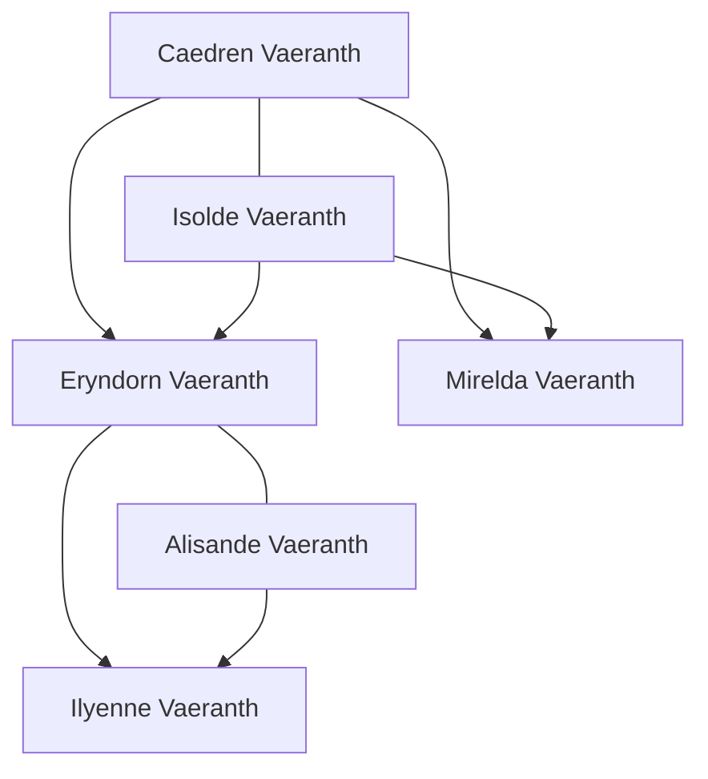

# Danstsud — hanedanlar ve büyü hukuku

7 Ekim 2026. **Yazar çalışma belgesi; halka açık olmayan aile bilgileri içerir.**

Bu bölüm iki tür yeni bilgiyi ayırır: kullanıcının doğrudan kararları ve hanedanı/ailesini oluşturma yetkisiyle hazırlanan yeni yazım. İsimler eski belgelerden bulunmuş gibi sunulmaz. Kaynak metinleri değiştirilmez.

## 1. Kullanıcının kesinleştirdiği bilgiler

- Eryndorn'un **bilinen bir erkek varisi yok**.
- Eryndorn'un **gayrimeşru oğulları var**. İsimlerini, annelerini, kaç kişi olduklarını ve kimlerin bunu bildiğini kullanıcı belirtmedi.
- Kraliyet hanedanının adı ve kralın ailesi bu çalışma içinde oluşturulacak.
- Elorwyn şehri **hep aynı yönetici hanedanın elinde olmuş**. Hanedan için Elorwynder benzeri ayrı bir isim oluşturulacak.
- **Ruhsatlı büyü kullanımı yasal. İzinsiz büyü uygulaması ve kurban ritüelleri yasak.** Ruhsatlı büyücü okul dışında da hizmet verebilir.

## 2. Vaeranth Hanedanı — yetkilendirilmiş yeni yazım

Danstsud'un güncel kraliyet hanedanının adı **Vaeranth**. Hükümdarın tam adı **Eryndorn Vaeranth**. Hanedanın ülkeyi hangi tarihten beri yönettiği veya kadim Valhunnar soyundan gelip gelmediği henüz belirlenmedi.

### Halka açık kraliyet ailesi

| Kişi | Akrabalık / durum | Yeni yazımda işlevi |
| --- | --- | --- |
| **Kral Caedren Vaeranth** | Eryndorn'un babası; önceki hükümdar, ölmüş | Eryndorn'un tahtının yakın geçmişini kurar. Sarayın hatırladığı önceki kral; hanedan tarihinin başlangıcı sayılmaz. |
| **Kraliçe Isolde Vaeranth** | Eryndorn'un annesi; ölmüş | Eryndorn ve Mirelda'nın annesi. Anne soyunun hanedanı henüz yazılmadı. |
| **Kral Eryndorn Vaeranth** | Güncel hükümdar | Zeki ve bilgiye aç; kendi arayışında tükenmiş. Yaptıklarını bilerek yapar, durursa daha kötüsünün olacağına inanır. |
| **Kraliçe Alisande Vaeranth** | Eryndorn'un eşi | Sarayın erzak, yardım ve harcama ihtiyaçlarını izleyen, somut sonuçlarla ilgilenen kişi. Kralın araştırma isteğine karşı kent yaşamının ihtiyaçlarını görünür kılar. |
| **Leydi Mirelda Vaeranth** | Eryndorn'un küçük kız kardeşi | Saray ile lord aileleri arasında görüşmeleri yürüten hanedan temsilcisi. Kral adına iletişim kurar; krala ait her kararı kişisel olarak benimsemesi gerekmez. |
| **Prenses Ilyenne Vaeranth** | Eryndorn ve Alisande'nin kızı; genç yetişkin | Kraliyet ailesinin halka açık meşru çocuğu. Sarayda yerel yönetim, kayıt ve hukuk konularını öğrenir. Taht üzerindeki hakkı henüz karara bağlanmış değildir. |

Alisande'nin kaybolmuş, ölmüş veya halen sarayda olduğu bu aile kaydıyla kesinleştirilmez. B belgesindeki “kayıp kraliçe” ifadesinin Alisande'ye bağlanması bir sonraki hikâye kararıdır. Aile üyeliğini yazmak, kayboluşun zamanını ya da nedenini yazmak anlamına gelmez.

### Kamuya açık aile şeması

### Veraset hakkında kesin olan ve olmayan

Kesin bilgi **bilinen erkek varisin bulunmaması**. Bu ifade tek başına kadınların tahttan dışlandığını, Ilyenne'nin otomatik veliaht olduğunu, kralın hiç çocuğu olmadığını veya tahtın mutlaka bir lorda geçeceğini söylemez.

Henüz seçilmemiş hukuk: doğum sırası, kadınların miras hakkı, gayrimeşru çocuğun tanınması, hükümdarın varis ilan etme yetkisi, lordların onay hakkı ve naiplik. Wiki yalnızca mevcut aileyi ve bilinen erkek varisin yokluğunu anlatır; bu boşluğu kesin bir veraset yasasıyla doldurmaz.

## 3. Gayrimeşru oğullar — yalnızca yazar bilgisi

İsimler ve aile çevresi, kullanıcının aileyi oluşturma yetkisiyle yazıldı. Kullanıcının belirttiği gerçek oğulların varlığıdır; sayıyı **iki** olarak bu sürüm belirler. Bunlar wikiye veya istemci veri dosyasına aktarılmaz.

| Kişi | Yeni aile bilgisi | Kendi hayatı |
| --- | --- | --- |
| **Corven** | Eryndorn'un gayrimeşru oğlu; annesi **Nella** | Yetişkin; annesinin cilt ve kitap onarım işinde yetişmiş. Kendi emeğiyle bir atölye sürdürmek ister. Kişiliği yalnızca kan bağına indirgenmez. |
| **Ossian** | Eryndorn'un daha küçük gayrimeşru oğlu; annesi **Brena** | Ergenlik çağında; annesi eski bir saray hizmetlisi. Aile kaydında tahta ilişkin bir amacı veya bağlı olduğu siyasi taraf belirlenmedi. |

Oğulların kral tarafından resmen tanınıp tanınmadığı, kendi babalarını bilip bilmedikleri ve kimliklerini kimlerin öğrendiği henüz seçilmedi. Geçici yayın kararı **kimliklerini yazar bilgisinde tutmak**; gizliliği bütün halkın bildiği gerçek veya kesin bir görev sırrı olarak kanon ilan etmiyoruz. Gelecekte görünürlükleri bilinçli biçimde değiştirilebilir.

Bu iki kişi mevcut maceralardaki NPC'lerin gizli kimliği yapılmadı. Kael, Kaelen, Varokh veya başka bir kaynak kişisiyle yalnızca isim/rol benzerliğinden birleştirilmeyecek.

## 4. Elorwynder Hanedanı

**Kullanıcı kararı:** Elorwyn hep bu hanedan tarafından yönetilmiş. **Yeni adlandırma:** Hanedan adı **Elorwynder**, şehir adı **Elorwyn**.

Vaeranth kraliyet hanedanı ile Elorwynder yönetici ailesi ayrı kayıtlardır. Aralarında gizli kan bağı, evlilik anlaşması veya tahta hak iddiası bu sürümde yaratılmadı.

Eski belgelerdeki **Tharion Elorwyn** ve **Damian Elorwyn**, yeni isimlendirmede **Tharion Elorwynder** ve **Damian Elorwynder** olarak geçer. Kaynak adları alıntılarda ve arama eş adlarında korunur. Kethra lordu olarak anılan Damian'ın rolü ad değişimi yüzünden silinmez.

### Halka açık çekirdek

- Şehrin bilinen yönetim tarihi Elorwynder ailesiyle süreklilik gösterir.
- Krallıkla bağlılık ile şehri yöneten yerel hanedan aynı düzeyde makam değildir.
- Lord Tharion ve Lord Damian aynı hanedanın üyeleri olarak kaydedilir.
- Elorwyn'in resmî bölge aidiyeti, güncel hanedan başı ve lordun yetki sınırı henüz belirlenmedi.

### Akrabalık için çalışma önerisi — henüz kanon değil

Tharion ile Damian'ın **kuzen** olması; birinin hanedanın şehir merkezindeki koluyla, diğerinin Kethra koluyla ilişkilendirilmesi önerilebilir. Bu, Damian'ın yerine geçme girişimini hem siyasi hem aile içi bir güç mücadelesi yapar.

Bu öneri henüz kamuya açık wikiye aktarılmadı. Tharion'u Elorwyn'in güncel hükümdarı ilan etmiyoruz; kardeş, kuzen veya farklı kuşaktan olmaları kullanıcıyla seçilecek. Kaynakta Tharion'un suçlamaları ile Damian'ın gerçek durumu birbirinden ayrılmayı bekliyor.

## 5. Büyü hukuku — kullanıcı kararı ve yeni uygulama düzeni

### Kesin kural

**Eğitimli ve ruhsatlı büyücüler okul dışında yasal hizmet verebilir. İzinsiz büyü uygulaması ve kurban ritüelleri yasaktır.** Eski kaynaklardaki genel “okul dışında yasak” ifadesi yeni kanonda **ruhsatsız uygulamaya getirilen yasak** olarak yeniden yazılır.

### Kraliyet Büyü Sicili — yetkilendirilmiş yeni yazım

Ruhsat düzenini somutlaştıran kurumun adı **Kraliyet Büyü Sicili**. Valdareth'te tutulan merkez kaydı; uygulayıcının adı, yetkinliğini doğrulayan eğitim kurumu/usta ve ruhsatın izin verdiği hizmet alanı kaydedilir. Bir okulun verdiği eğitim belgesi ile uygulama ruhsatı ayrı işlemlerdir.

Şehirde büyü hizmeti alan biri uygulayıcının ruhsatını kontrol ettirebilir. Lordlukların yerel görevlileri ruhsatı denetleyebilir; bütün ülke için aynı sicil kuralı geçerlidir. Henüz vergi/harç oranı, ruhsat süresi, denetçilerin unvanı veya okul listesi yazılmadı.

### İzin verilen ve yasak olan

| Uygulama | Hukuki durum |
| --- | --- |
| Geçerli ruhsat kapsamındaki büyü hizmeti | Okul dışında da yasal |
| Eğitim almış kişinin ruhsatsız hizmet vermesi | İzinsiz uygulama; yasal değil |
| Ruhsatın izin verdiği alanın dışındaki uygulama | İzin kapsamının dışında; yasal değil |
| Büyüye güç sağlamak için canlı kurban veya başkasının yaşamını soğurma | Ruhsat bulunsa da yasak |
| Sıradan dua, büyü içermeyen bakım veya zanaat | Sırf tapınak/şifacı/lonca çevresinde yapıldığı için büyü uygulaması sayılmaz |

Canlı kurban yasağı, D belgesindeki yasak yaşam soğurma tekniğiyle birlikte okunur. Kişinin kendi kanını kullandığı her tekniği otomatik olarak bir kurban ritüeli ilan etmiyoruz. Kan büyüsünün teknik sınıfları ve bazı Honud geleneklerinin ruhsatlandırılması ayrıca incelenecek.

### Kurumlara etkisi

- **Theramis Loncası:** Büyücülü bir loncanın yasal hizmet vermesi mümkün. Bunun için ruhsat gerekir; lonca üyeliği tek başına uygulama izni değildir.
- **Şifacılar ve simyacılar:** Büyüyle yapılan tedavi ruhsat kapsamındadır. Büyü içermeyen hekimlik veya sıradan ilaç hazırlama aynı işlemin adı değildir. Zylara'nın her tedavisinin büyü olduğu varsayılmaz.
- **Tapınaklar:** Gerçek büyü uygulaması varsa ruhsat düzeni geçerlidir. Genel dua ile mana uygulaması ayrılır.
- **Hardlane:** Aynı ülke hukuku geçerlidir; merkezî idarenin zayıflığı, denetimin fiilen zayıf kalmasına yol açar. Vergi/sicil/koruma erişimindeki eşitsizlik yasanın her yerde yürürlükten kalktığı anlamına gelmez.
- **Eryndorn:** Tahtta olduğu bu dönemin yasal çerçevesi budur. Kralın yasayı gizlice ihlal edip etmediği genel wiki bilgisinin konusu değildir.

### Açık kalan hukuk ayrıntıları

Yabancı ruhsatların tanınması, Honudlu uygulayıcıların eşdeğerlik alması, kendi kanını kullanan büyünün denetim sınıfı, ceza ve yargılama, acil hayat kurtarma istisnası ve bölgeler arası denetim uyuşmazlıkları henüz yazılmadı. Bu boşluklar ruhsatlı büyünün okul dışında serbest olduğu temel kuralı değiştirmez.

## 6. Kaynaklardan kalan hikâye kararları

1. B'deki kayıp kraliçe Alisande mi? Kayboluş hangi tarihte, halk bunu biliyor mu?
2. Tharion ile Damian'ın tam akrabalığı ve Elorwynder'in güncel başı kim?
3. Ilyenne'nin veraset hakkı hangi hukukla belirleniyor?
4. Corven ve Ossian'ın kimliğini kimler biliyor; baba tarafından tanınmışlar mı?
5. Tharion'un suçlamalarında ve Damian hakkında sunulan kanıtlarda gerçek olan ne?

Bu kararlar için hazır bir olay sonucu yazılmadı. Darbe öncesi wiki aileyi, yönetimi ve yasayı anlatır; gelecekteki darbe veya aile sırlarını gerçekleşmiş tarih olarak yayımlamaz.
