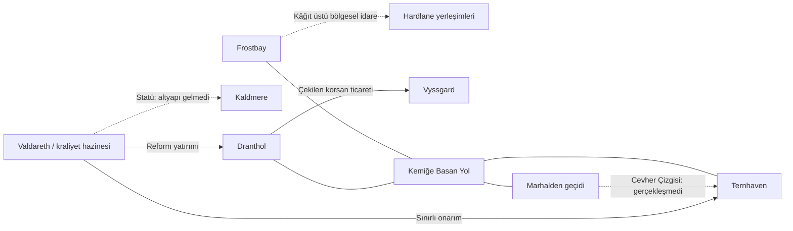

# Hardlane — kıyılar, ocaklar ve yarım kalan reform

8 Ekim 2026. **Yazar çalışma belgesi.** Güncel dünya darbe öncesidir; Eryndorn Vaeranth tahtta. Bu dosya kullanıcının verdiği bilgilerle yetkilendirilmiş yeni yazımı ayırır, ardından wikiye aktarılan tam metinleri içerir. Özgün DOCX, PDF ve 8K harita değiştirilmedi.

## Kullanıcının doğrudan verdiği temel

| Yer / konu | Kesinleştirilen bilgi |
| --- | --- |
| Frostbay | Hardlane’in en eski, kökeni bilinmeyen büyük yerleşimi; yaklaşık 45–50 bin kişi. Haşmetli harabeler posta, gümrük ve idare için kullanılıyor. Garnizon şehir güvenliğine yetmiyor. Korsan ve yağmacılar için korunaklı ticaret alanı. Honudlu mültecilerin ilk uğraklarından. |
| Frostbay’in geçimi | Altı ay düşük verimli tarım, az otlak, balıkçılık ve avcılık. Küçük fener. İnce don altında ot bulabilen özel hayvanlar için yeni yazım istendi. |
| Bryndon | Theramisli kâtip/araştırmacı. Yuvarlak taş yığma yapılar ve değirmenlerden geçmişte iklimin daha elverişli olduğu ihtimalini araştırıyor. Eski kitap biçiminde, onun birinci şahıs bakış açısıyla anlatı istendi. |
| Kaldmere | Danstsudlu mültecilerin kurduğu kamp → köy → küçük şehir. Kurucu yerli nüfus yok. Barakalar, kamu altyapısı ve kraliyet otoritesi yok; az tüccar, küçük liman, buz deliği balıkçılığı, av ve orman. Adı “son umut”. Eryndorn döneminde şehir statüsüne ulaştı. |
| Dranthol | Eski yaklaşık 1.500 kişilik yerleşim, reformlar ve göçle toplam yaklaşık 15.000 kişi. Küçük garnizon yerine büyük kale, liman, fener. Bölgenin kişi başına en güçlü güvenliği. Korsan parasının çekilmesiyle Frostbay’den daha köhne ve ekonomik olarak zayıf. |
| Dranthol ve Vyssgard | Korsanlar gemilerini açıkta bırakıp kürekli teknelerle Vyssgard’a gidiyor. |
| Vyssgard | Önceden önemli kent; göç, mülteci ve suç örgütlerinin gelişinden sonra çetelerin zorla uyguladığı kendi kanunları var. Kraliyet otoritesi işlemiyor; sıradan köylü çok az. |
| Ternhaven | Rydorn Sırtı’nın sıcak sularıyla görece ılıman küçük şehir. Eski Hardlane kültürü baskın, diğerlerine göre göç ve suç akışı daha az. Az üretip kendine yetiyor; iki reformdan yararlandı. |
| İki reform | **Kül Üzerine Ocak Kanunu** yerleşim statüsü; **Mahrumiyet Mıntıkayı İskân ve Sermaye Tevzi Kanunnamesi** yatırım. İkisinin de ayrıntılı metni istendi. |
| Cevher Çizgisi | Ternhaven–Marhalden yol projesi hiç hayata geçmedi. Marhalden’in mülteci kapılarını kapatması, Vyssgard ve başkentteki karışıklıklar işi engelledi. |
| Kemiğe Basan Yol | Ternhaven, Dranthol, Frostbay ve Marhalden’i bağlayan çok uzun ve güvensiz gayriresmî ticaret güzergâhı. |
| Göç ve kültür | Son dönemde çok sayıda Danstsudlu göçmen ve mülteci. Başkentten ve başka kıtalardan kaçan aranan kişiler de Hardlane’e geliyor. Kültür için yeni yazım istendi. |
| Ak Cam Denizi | Ternhaven ve Dranthol önündeki donmamış deniz. |
| Ayaz Yutan | Dranthol’un aşağısındaki boğaz; bundan sonra donmuş deniz koşulları. |
| Kırağı / Son Nefes | Danstsud ile Honud’u ayıran aynı donmuş deniz. Yürüyerek geçmek neredeyse imkânsız. Çok rüzgârlı, sığınaksız, kırılgan; çatlaklar, hızlı akıntı, tekrar donma ve basınçla buz kırılmaları. |
| Soluk Su | Dranthol–Ternhaven arasındaki kıyı suları; sis ve rüzgâr gemileri karaya veya kayalıklara sürüyor. |
| Kefen Denizi | Danstsud’un doğuya bakan tarafında ayrı don örtüsü. Kopuk buzlar kıyı boyunca Ak Cam, Kırağı ve Soluk Su’ya taşınıyor. Örtüler arasında kesintisiz bağ yok. |

## Kullanıcının oluşturma yetkisiyle eklenenler

- **Frostbay mekânları:** Dairetaş, Yamaiskele, Dar Soba, Kırık Kanat; Taş Halka postahanesi, İkinci Halka gümrüğü, Sessiz Avlu ve Alçak Işık feneri.
- **Frostbay görevlileri:** İskele Vekili **Nera Veld**, Nöbetbaşı **Odran Vehl**. Bunlar kentte sınırlı işleri yürüten kişiler; bütün Hardlane üzerinde etkin egemen veya yeni büyük lord değiller. Atanma tarihleri ve aileleri henüz yazılmadı.
- **Dranthol:** Ocak Kalesi, Nöbet Işığı ve Ocak Muhafızları. Yeni inşaat işinin sona ermesiyle iş bulma ve kiraya ilişkin gerilimler.
- **Ternhaven:** Sıcak Saz Avluları; sıcak suyun çevresinde ortak kurutma ve stok işleri.
- **Kaldmere:** Son Lokma geleneği; farklı Danstsud yörelerinden gelen ailelerin ibadet ve dayanışma çeşitliliği.
- **Vyssgard güç odakları:** Kanca Rıhtımı, Kör Fener, Kırık Örs, Yaslı Halat ve Kül Deposu; birlikte **Beş İskele Sözleşmesi**. Tuz Tartısı uyuşmazlık masası, İskele Payı, Kapalı Bıçak, kefil ve borç defteri. Ayrıntılı çete liderleri, aralarındaki ittifaklar ve kaçak malların sahipleri henüz yazılmadı.
- **Kültür:** Ocak Hatırı, İlk Tas Hakkı, Kıyı Eskileri, İkinci Duman ve Buz Çatısı Gecesi. Yerleşimler bunları farklı yaşar; tek bir ortak din veya bütün gelenleri aynı kişilikte gösteren kültür kurulmadı.
- **Doğa:** Kırağı Boynuzlu Tervan, Kütburunlu Norruk, Saztırnaklı Velkir; Camotu, Don Sazı ve İnce Yaz Arpası. Türlerin ölçüleri, görünüşü, davranışı ve bakım sınırları yeni yazım.
- **Kanunların bütün maddeleri:** Statü için 12, yatırım için 14; Vyssgard sözleşmesi için 11. Kullanıcı yasa adlarını ve amaçlarını verdi; madde içerikleri, Ocak Sicili, Kuzey Ocak Sandığı ve Üç Makbuz Usulü bu çalışma içinde üretildi.
- **Bryndon’un bütün kitap metni:** Yaprak izi, kök kesiti, taş olukları, çocuk, çoban ve mülteci kadınla konuşmaları yeni edebî yazım. Önceden yüklenen belgelerden alınmış bir tarihî alıntı değildir.
- **Buz Solunumu:** Kullanıcının tarif ettiği hareketli donma/kırılma döngüsünün yerel adı. Denizlerin yeni kesin koordinatları veya dönemsel güvenli geçiş takvimi üretilmedi.

## Tutarlılık için alınan kararlar

1. **Frostbay hâlâ kâğıt üstü merkez.** Dranthol yeni kraliyet garnizonu, Ternhaven sınırlı yatırım istisnasıdır; bunlar Hardlane’in tamamına ulaşan güçlü bir kraliyet idaresi kurmaz. Harven/Mavric’in Marhalden asker ve vergi bağı da devam eder.
2. **Statü ≠ yatırım tahsisi ≠ teslim edilmiş hizmet.** Kaldmere’in adı ve statüsü, altyapısının bulunduğunu göstermez. Reform metinleri ideal işleyişi düzenler; şehir sayfaları uygulanmış sonuçları gösterir. Krallığın amaçladığı ile sağlayabildiği arasındaki mesafe evrenin siyasi gerilimidir.
3. **Vergi değişmedi.** Yeni şehir beratı otomatik genel Hardlane toprak vergisi kurmaz. Frostbay’in sınırlı tahsilatı korunur; Dranthol’un güvenliği kraliyet yatırımıyla açıklanır. Henüz oran veya yeni zorunlu kalem seçilmedi.
4. **Marhalden tek düzenli kara eşiği.** Kemiğe Basan Yol doğuya ulaşırken yine bu geçide dayanır. Batıda tamamlanmış kraliyet yolu veya ikinci güvenli dağ geçidi oluşturmaz. Deniz yerleşimleri ve deniz ticareti var olmaya devam eder.
5. **Kapılar insan ve yüke farklı davranır.** Marhalden mülteci girişini kapattı; izinli erzak ve ticaret tamamen bitmedi. Bu ayrım hem Marhalden’in beslenmesini hem Hardlane’in çok pahalı ticaretini mümkün kılar.
6. **Cevher Çizgisi yapılmadı.** Proje adı, tasarı ve tahsis tamamlanmış güzergâh olarak haritaya çizilmez. Kemiğe Basan Yol onun yeni adı değildir.
7. **Darbe öncesi zaman korunur.** Başkentteki karışıklık burada idare ve iaşe gerilimi olarak yazıldı. Önceki kampanya belgelerindeki darbe sonuçları gerçekleşmiş sayılmadı.
8. **Dranthol nüfusu yaklaşık toplam 15.000.** Yaklaşık 1.500’ün on katı; eski nüfusa ayrıca on kat eklenip 16.500’e çevrilmedi. Frostbay yaklaşık 45–50 bin; kesin sayım değildir.
9. **Sınırlı besin üretimi.** Don altında bitki sürekli yeniden büyümez. Hayvanlar yalnız ince kabuk altındaki bitkiye ulaşır; kış yemi gerekir. Frostbay’in altı aylık tarımı büyük nüfusuna yetmez. Ternhaven’in kendine yetmesi bütün Hardlane’i beslediği anlamına gelmez.
10. **Kaldmere’in hayatta kalma avantajı öğrenilmiş beceridir.** Danstsudlu mültecilerin getirdiği av, orman ve stok bilgisi; bütün bir halkın biyolojik üstünlüğü olarak yazılmadı. Buradaki farklı inançlar aynı krallığın farklı yörelerinden gelir.
11. **Bryndon’un ihtimali kesin geçmiş değildir.** Daha yumuşak iklim, güçlü dış tahıl ticareti ve farklı dönemlerin üst üste gelişi birlikte incelenir. Evren içi anlatıcı gözlem ve yorumlarıyla sınırlıdır. Kıyının neden soğuduğu, ustaların kimliği ve Büyük Kırılma ile kesin bağı açıklanmadı.
12. **Buzlar taşınır, örtüler birleşmez.** Kefen’den sürüklenen parçalar açık Ak Cam’da bulunabilir. Kırağı ile kesintisiz yürünebilir buz köprüsü veya her mevsim güvenli rota oluşmaz. Ak Cam’ın açık oluşu ile soğuk iklim tutarlıdır.
13. **Vyssgard’ın hukuku yerel zor düzenidir.** Kraliyetçe tanınmış şehir anayasası veya herkesin özgürce kabul ettiği bir sosyal sözleşme değildir. Çeteler kendi ticaretini korur; güçsüz sakinler aynı hakları elde edemez. Göç ve mülteci gelişi, bütün suçların tek nedeni olarak yazılmadı.

## Yerleşim ve ulaşım ilişkisi

Bu şema yön ve uzaklık ölçümü değildir. Mevcut geçim bağlarını gösterir; deniz haritası veya güvenli rota ilanı değildir.

## Açık kalan geliştirme alanları

Bu boşluklar mevcut metnin kullanılması için onay gerektirmez; sıradaki ortak evren yazımında derinleştirilebilir.

- **Reformların takvimi:** Ne kadar zaman geçti, hangisi önce çıktı, 1.500 → 15.000 büyüme kaç yıl sürdü? Şimdilik kesin dünya yılı veya büyüme hızı yok.
- **Devam bütçesi:** Dranthol garnizonunun sayısı, hangi kraliyet gelirinden sürdürüldüğü, tahsis kesildiğinde öncelikli ödeme ve kışlık tedarik. “En fazla kişi başına güvenlik” kesin asker sayısı değildir.
- **Fiilî makamlar:** Ternhaven’in yerel karar çevresi, Kaldmere’de haneler arası temsil, Dranthol kale komutanı ve Vyssgard’ın beş lideri. Genel işleyiş kuruldu; kişisel çıkarlar ve aile ilişkileri geliştirilebilir.
- **Nüfus ve üretim sınırı:** Diğer üç şehrin nüfusları, Hardlane toplamı, verimli alanların ölçüsü, yıllık yiyecek açığı ve taşıma kapasitesi verilmedi.
- **Ceza ve yargı:** Kraliyet yasalarının bütün cezaları, aranan yabancı kişilerin iadesi, af ve köle ticaretinin krallık çapındaki hukuki statüsü henüz belirlenmedi. Vyssgard sığınağı hukuken genel af sayılmaz.
- **Kaldmere’in statü belgesi:** Mevcut kral döneminde statü kullanıcı kararı; dosyası ne zaman ve kimin girişimiyle onaylandı, yatırımı tam olarak nerede takıldı henüz seçilmedi. Yazım kamu hizmetinin yokluğunu rüşvet veya tek bir gizli failin kesin sonucu yapmaz.
- **Cevher Çizgisi’nin hesapları:** Ayrılan ama ulaşmayan sermayenin miktarı, sorumlular ve daha önce yapılan hazırlıkların maddi izleri. Başarısızlığın genel nedenleri var; bir kişiyi suçlayan yeni sır yok.
- **Eski Frostbay:** Ustalar, kesin kuruluş çağı ve iklim değişiminin nedeni açık. Bryndon’un araştırması bu soruları canlı tutar; gizli görev cevabını açıklamaz.
- **Deniz ölçümü:** Yeni adların özgün haritadaki kesin sınırları, akıntı yönünün ayrıntılı kıyı çizimi, yol etapları ve mesafeler. Yeni metinden keyfî koordinat çıkarılmadı.

**Önerilen sonraki adım:** Dranthol’un garnizon, hazine ve yiyecek hesabını aynı mevsime göre kurmak. Ardından Frostbay’in tahsilat kapasitesi ve Vyssgard’ın güç odakları karşılaştırılabilir. Böylece reformların sonucu, yalnız iyi veya kötü bir yönetici sözü yerine somut kaynak ve çıkarlarla açıklanır.

## Wikiye aktarılan tam metinler

Aşağıdaki metinler web verisiyle aynı kaynak kayıtlardan çıkarıldı. Kaldmere özgün haritadaki yerleşim olarak pin aldı; diğer yeni hukuk, kültür, deniz ve yol kayıtları mevcut şehir/bölge konumlarına bağlanır.

## Hardlane

Eski kıyılar, yeni ocaklar ve eşitsiz reform

**Wiki kaydı:** `hardlane`

Karlan’ın batısındaki beş kıyı şehri. Frostbay’in kadim taşları, Dranthol’un yeni kalesi ve Kaldmere’in barakaları, aynı krallığın farklı hayatlarını taşır.

### Karlan’ın batısındaki yaşam

Hardlane, Karlan Dağları’nın batısındaki zor Danstsud topraklarıdır. Ternhaven, Dranthol, Frostbay, Vyssgard ve Kaldmere kıyıda farklı hayatlar sürer. Marhalden geçidi doğuya açılır; geniş bölgenin resmî idaresi Frostbay’e bağlı görünse de gerçek yetki yerden yere değişir.

Eski kıyı halkının yanına son dönemde çok sayıda Danstsudlu göçmen ve mülteci gelmiştir. Honud’dan kaçanlar Frostbay’e uğrar; başkentten ve başka kıtalardan aranan kişiler de merkezî idarenin zayıflığını son sığınak olarak görür. Bir ev arayan aile, iş arayan göçmen ve kanundan kaçan biri aynı sebeple gelmiş değildir.

| Yerleşim | Öne çıkan yaşam | Güncel durum |
| --- | --- | --- |
| Frostbay | 45–50 bin kişi; eski yapıların içinde büyük kıyı pazarı | Sınırlı idare ve gümrük; yetersiz garnizon |
| Kaldmere | Danstsudlu mültecilerin kurduğu küçük şehir | Barakalar, küçük liman; kamu altyapısı ve kraliyet otoritesi yok |
| Dranthol | Yaklaşık 1.500’den 15.000 kişiye büyüyen reform yerleşimi | Bölgenin kişi başına en güçlü güvenliği; zayıf altın akışı |
| Vyssgard | Eski kentin çeteler ve kaçak ticaretçe paylaşılması | Zorla uygulanan yerel kurallar; kraliyet idaresi işlemiyor |
| Ternhaven | Rydorn sıcak sularında eski Hardlane kültürü | Görece ılıman ve kendine yeten şehir; yol fırsatı kaybedilmiş |

### Bağlılık ve eşitsizlik

Hardlane Danstsud’a bağlıdır; halkı merkezdeki güvenlik, yol ve kamu hizmetlerine eşit ölçüde ulaşamaz. Bölgeyi kraliyetin kaydında görmek, bir kış gecesi yardımın gerçekten gelebileceği anlamına gelmez.

Eryndorn Vaeranth’ın Kül Üzerine Ocak Kanunu yerleşim statülerini, Mahrumiyet Mıntıkayı İskân ve Sermaye Tevzi Kanunnamesi yatırımları düzenlemiştir. Dranthol ile Ternhaven reformlardan yararlandı. Kaldmere’in şehir boyutuna ve statüsüne ulaşması ise su hattı, düzenli yol veya muhafız getirmedi.

### Frostbay’in sınırlı idaresi

Frostbay’in posta, gümrük ve yerel kayıt işleri, kimlerin inşa ettiği bilinmeyen kadim taş yapılarda yürütülür. Bölgenin en eski şehrindeki garnizon kendi sokaklarının tamamını koruyamaz. Diğer yerleşimler üzerindeki geniş yetki çoğunlukla kâğıtta kalır.

Hardlane genelinde düzenli kraliyet vergisi işlemez. Frostbay sınırlı tahsilat ve hizmetin eski istisnası, Dranthol kraliyet yatırımı ve garnizonunun yeni güvenlik istisnasıdır. Bu iki durum bölgenin tamamında işleyen merkezî yönetim kurmaz.

Harven ve Mavric’te Marhalden askerlerinin fiilî koruma ve yerel vergi düzeni ayrı bir bağlılıktır. Kralın Yolu Marhalden’de biter; bu köylerin askerî izleri veya Kemiğe Basan Yol, kraliyet ana yolunun batıya uzatılmış hali değildir.

### Kemiğe Basan Yol ve eksik Cevher Çizgisi

Kemiğe Basan Yol, Ternhaven, Dranthol ve Frostbay’i Marhalden’e bağlayan uzun, gayriresmî ticaret hattıdır. Bazı parçaları orman izi, bazıları kıyı yürüyüşü, bazıları yüklerin sırtta taşındığı dar patikadır. Mevsime göre yön değiştiren bu hat, güvenli ve sürekli bir şose değildir.

Ternhaven ile Marhalden arasında tasarlanan Cevher Çizgisi, daha düzenli bir yük yolu kuracaktı. Marhalden’in mülteci girişini kapatması, Vyssgard’daki suç düzeni ve başkentin karışıklıkları projeyi hayata geçirmedi. Kapanan kapılar, ticaretin bütünüyle durmasından çok insanlara ve yüke farklı davranıldığı bir geçiş rejimi yaratır.

### Denizin değişen yüzleri

Ternhaven ve Dranthol önündeki Ak Cam Denizi bağlı buz örtüsü taşımayan sudur. Aralarındaki Soluk Su’da sis, rüzgâr ve kayalıklar gemileri kıyıya sürer. Dranthol’un aşağısındaki Ayaz Yutan Boğazı’ndan sonra donmuş deniz kuşağı başlar.

Danstsud ile Honud arasındaki Kırağı Denizi, Son Nefes Denizi adıyla da bilinir. Çatlayan, akıntıyla yer değiştiren ve yeniden kapanan buz, yürüyerek aşılacak sağlam bir köprü oluşturmaz. Doğuya bakan Kefen Denizi’nin ayrı buzları kıyı akıntılarıyla başka sulara taşınır; açık denize gelen bir buz parçası orada da kalıcı örtü olduğu anlamına gelmez.

### Ocakların kültürü ve eski yeşilin şüphesi

Eski kıyı halkı, bir evin kışlık emeğine ocak der: ateş kadar tuz, kuru yakıt ve birlikte tutulan stok da bu adın içindedir. Ternhaven’de bu alışkanlıklar güçlü biçimde sürer; göçlerle büyüyen şehirlerde yeni inanç ve yemeklerle birleşir. Vyssgard çeteleri kimi eski sözleri kendi zor düzenine çevirmiştir.

Theramis’ten gelen Kâtip Bryndon, Frostbay’in yuvarlak taş yığma yapılarını ve eski yel değirmenlerini inceler. Bugünkü soğuk içinde bu kadar geniş ve korunaksız yapıların niçin kurulduğu, bölgenin bir zamanlar daha yaşanabilir ve yeşil olduğu şüphesini besler. Araştırması geçmişin bütün nedenlerini çözmüş bir tarih değildir.

## Frostbay

Kadim taşların arasındaki kalabalık kıyı

**Wiki kaydı:** `frostbay`

Yaklaşık 45–50 bin kişinin yaşadığı Hardlane’in en eski şehri. Bilinmeyen ustaların taş yapıları posta ve gümrüğe ev sahipliği yapar; yetersiz garnizon, mülteciler ve korsan ticareti aynı sokakları paylaşır.

### En eski kıyı şehri

Frostbay, Hardlane’in en eski ve en ilgi çekici şehridir. Kimin kurduğu ve ilk yapıların hangi tarihte yükseldiği bilinmez. Bugün hâlâ duran haşmetli taş binalar, aralarına eklenen barakalar ve düşük gelirli hanelerle aynı sokakları paylaşır. Kadim bir kapının altında yamalı kumaştan bir dükkân açılabilir.

Yaklaşık 45–50 bin kişinin yaşadığı tahmin edilir. Posta defterine giren hane sayısı bütün nüfusu göstermez: mevsimlik denizciler, barakalarda kalanlar ve yeni gelen mülteciler kayıtta eksik olabilir. Kalabalığına rağmen şehrin kaynakları ve idaresi kırılgandır.

### Dairetaş ve kullanılan harabeler

Dairetaş, yuvarlak taş yığma yapılarla dolu eski idare kesimidir. Taş Halka binasında postahane, İkinci Halka’da gümrük kaydı, Sessiz Avlu’da yerel görüşmeler yürütülür. Duvarların bazıları en eski yerel kayıtların hatırlayabildiği onarımlardan da önceye uzanır.

İdare bu binaları kökenlerini bildiği için değil, ayakta kaldıkları ve elde başka mekân az olduğu için kullanır. Yeni kapı eski kemere uydurulur, zemin üstüne tahta serilir, kayıp taşın yerine daha küçük taşlar sıkıştırılır. Geçmiş, gündelik işlerin altında görünür kalır.

### Yamaiskele, Dar Soba ve Kırık Kanat

Yamaiskele, depo, rıhtım ve küçük tüccarların kıyısıdır. Dar Soba’da mülteci haneleri ile düşük gelirli aileler dar barakalarda yaşar; aynı bacayı paylaşan evler vardır. Kırık Kanat, eski değirmen gövdelerinin ev ve depo olarak kullanıldığı kesimdir. Küçük fener Alçak Işık, kenti büyük deniz fenerli Dranthol’dan farklı bir siluetle gösterir.

Honudlu mültecilerin ilk uğraklarından biri olan şehirde, tercümanlık, geçici yatak, iş ve yiyecek bulmak aynı anda gerekir. Yardım bağı kuran haneler ve gelenlerden yararlanan aracılar aynı mahallelerde bulunur. Bir evin kökeni, orada yaşayanların bütün kararını açıklamaz.

### Sınırlı hizmet ve tahsilat

İskele Vekili Nera Veld’in yürüttüğü yerel idare, posta, tartı, sınırlı gümrük ve bakım işleriyle ayakta kalır. Bu gelir her sokağa güvenlik veya altyapı sağlamaya yetmez. Frostbay bölgenin kâğıt üzerindeki merkezi olarak görünürken gerçek erişimi kent içinde dahi kesintilidir.

Nöbetbaşı Odran Vehl’in garnizonu vardır; rıhtımlar, baraka kesimleri ve eski yapılara yayılmış büyük nüfusu bütünüyle koruyamaz. Sınırlı tahsilat, Hardlane’in tamamına yayılmış düzenli kraliyet vergisi değildir. Harven ve Mavric’teki Marhalden bağlılığı ayrı işler.

### Korsanların da uyuduğu korunak

Kentin kıyı şekli ve limana sığınan küçük koylar, yağmacı ve korsanlara ticaret yapabilecekleri, bazen de rahat uyuyabilecekleri doğal koruma sağlar. Onların getirdiği para, liman emeği ve mal akışı şehrin pazarını büyütür. Aynı akış tehdidi, borcu ve zorla alınan payları da taşır.

Frostbay’in her sakini korsan değildir. Balıkçı, avcı, katip, işçi ve çocukların gündelik hayatı bu ekonominin çevresinde sürer. Yerel idarenin neyi denetleyebildiği ile tüccarın neyi soruşturmadan satın aldığı arasındaki boşluk, şehrin servet ve güvensizliğinin birlikte büyüdüğü alandır.

### Altı aylık tarla ve kışlık yiyecek

Tarım yılın yaklaşık altı ayında, düşük verimle yapılabilir. İnce Yaz Arpası, kök bitkiler ve korunaklı küçük bostanlar şehir için katkıdır; bu kadar kalabalık nüfusu tek başına doyurmaz. Kıyı ticareti, dışarıdan gelen tahıl, balık ve av ürünleri beslenmeyi tamamlar.

Az sayıdaki otlakta Kırağı Boynuzlu Tervan, Kütburunlu Norruk ve Saztırnaklı Velkir beslenebilir. İnce don kabuğunu kırıp altında kalmış ot, saz kökü veya likene ulaşırlar. Bitki kışın sürekli yeniden büyümez; haneler yem, kuru balık ve yakıt biriktirir.

Frostmere’in yılın yarısı donması, kıyı balıkçılığını mevsime bağlar. Donmuş denizin açık yarıkları ile göldeki akıntı ağızları aynı güvenilirliği taşımaz. Ürün saklamak için tuz ve yakıt bulmak, avın kendisi kadar önemlidir.

### Bryndon’un ölçtüğü eski şehir

Theramis kâtipleri ve araştırmacıları, kentin izlerini binlerce yıl geriye götürebilecek yapı tabakalarını inceler. Bryndon, yuvarlak kuru taş yığma tekniği, değirmen yatakları, geniş dış avlular ve eski su giderleri arasında ilişki kurar.

Bir değirmenin varlığı tek başına çevresinde tahıl yetiştiğini kanıtlamaz; değirmen başka ürünleri de işleyebilir veya tahıl dışarıdan gelmiş olabilir. Bryndon’un merakı, bu yapıların bir arada nasıl bir hayatı mümkün kıldığında yoğunlaşır. Kıyı Defteri bu arayışı kendi sesiyle anlatır.

## Ternhaven

Rydorn’un sıcak sularında eski kıyı hayatı

**Wiki kaydı:** `ternhaven`

Sıcak suların çevresinde görece ılıman ve kendine yeten küçük şehir. Eski Hardlane kültürü güçlüdür; iki reformla iyileşen yaşam, tamamlanmayan Cevher Çizgisi’ni bekler.

### Rydorn’un sıcak su kıyısı

Ternhaven, Rydorn Sırtı’ndan gelen sıcak suların oluşturduğu küçük, ılıman ve daha yaşanabilir bir Hardlane şehridir. Sıcaklığın en belirgin olduğu dere ve kıyı kesimleri çevresinde evler, küçük bostanlar ve çalışma alanları vardır; bütün bölge aynı derecede sıcak değildir.

Eski Hardlane halkı ve kültürü burada baskındır. Öteki şehirlere göre göçmen, mülteci ve suçlu akışı daha azdır. Bu göreli sakinlik, Ternhaven’in gündelik işlerini aynı hanelerin uzun süre birlikte yürütmesine imkân verir.

### Az eken, az biçen şehir

Şehir az eker, az biçer; korunaklı tarla, balık, hayvan, av ve kıyı ticareti birlikte yaşamasını sağlar. Kendi temel ihtiyacını karşılayabilir. Sıcak su çevresinde büyüyen küçük ürün fazlası, büyük bir tahıl ihracatına dönüşmez.

Sıcak Saz Avluları diye anılan ortak kurutma yerlerinde balık ve ot hazırlanır. Düşük mevsimde haneler iş ve yakıt paylaşır. Yeterli stok tutmak, ılıman suya sahip olmaktan ayrı bir emektir.

### Reformların ulaştığı kıyı

Kül Üzerine Ocak Kanunu ve Sermaye Tevzi Kanunnamesi Ternhaven’e daha yaşanabilir bir düzen getirdi. Yerel onarımlar, küçük iskele ve ürün depolama olanakları, şehrin mevcut topluluk ağının üzerine eklendi. Kentin bütün kültürü yeni gelen devlet görevlileri tarafından kurulmuş değildir.

İdari kaydı Frostbay’e bağlıdır; yerel hanelerin birlikte yürüttüğü işlerle sınırlı kraliyet yatırımı aynı alanda bulunur. Ternhaven’in düzeni, Hardlane’in bütün kıyısında aynı kapasitenin var olduğunu göstermez.

### Hayata geçmeyen Cevher Çizgisi

Marhalden ile kurulması beklenen Cevher Çizgisi, Ternhaven için büyük bir fırsattı. Daha düzenli bir yol, maden şehrinin ürününü kıyıya ve kıyının yiyeceğini geçide taşıyabilirdi. Proje hiçbir zaman hayata geçmedi.

Marhalden’in mülteci girişini kapatması, Vyssgard’daki suç düzeni ve başkentteki iaşe ile idare karışıklıkları işin sürdürülmesini engelledi. Kıyıdaki ihtiyaç sürerken ödeneklerin, ustaların ve bakım sorumluluğunun birbirini beklemesi projeyi kâğıtta bıraktı.

### Kemiğe Basan Yolun uzun bedeli

Gayriresmî Kemiğe Basan Yol, Ternhaven, Dranthol, Frostbay ve Marhalden’i birbirine bağlar. Hattın aşırı uzunluğu, değişen mevsim parçaları ve güvenlik eksikliği düzenli ticaret için büyük engeldir. Bir ürün yola çıktığında teslim edilebilecek miktarı yolun kendisi azaltabilir.

Ternhaven kıyıyla ticaretini sürdürür; fakat eksik yol, Hardlane’in daha farklı bir geleceğine açılabilecek fırsatın kaybıdır. Eski kıyı haneleri bugün hâlâ yollarına, stoklarına ve birbirlerini tanımalarına dayanarak yaşar.

## Dranthol

Yeni kale, azalan korsan ve çekilen altın

**Wiki kaydı:** `dranthol`

Reformlarla yaklaşık 1.500’den 15.000 kişiye büyüyen liman şehri. Büyük kale ve deniz feneri Hardlane’in kişi başına en güçlü güvenliğini sağlarken korsan ticaretinin çekilmesi pazarı daraltır.

### Bin beş yüz kişiden on beş bine

Dranthol, eski Hardlane halkından yaklaşık 1.500 kişinin yaşadığı küçük bir yerleşim ve minicik garnizon çevresinde büyüdü. Eryndorn Vaeranth’ın iki reformu statü, yerleştirme ve yatırımı buraya taşıdı; göç dalgasıyla toplam nüfus yaklaşık 15.000’e, eski nüfusun on katına ulaştı.

Eski kıyı sokakları birdenbire büyük bir askerî yapı ve yeni gelen çok sayıda haneyle çevrildi. Kiralar, pazar ihtiyacı ve günlük yük miktarı eski yerleşimin ölçeğini aştı; büyüyen nüfus için iş bulmak kalenin inşası kadar hızlı olmadı.

### Ocak Kalesi, yeni liman ve Nöbet Işığı

Küçük garnizonun yerini büyük Ocak Kalesi aldı. Liman ve Nöbet Işığı adlı deniz feneri hızla inşa edildi; depo, kapı ve askerî yanaşma düzeni yeni yatırımla kuruldu. Kale, iskân politikasının görünen imzasıdır.

Kraliyet yatırımı asker, taş ustası, yük taşıyıcısı ve iş arayan aileleri getirdi. İnşaat işi azaldığında aynı hanelerin başka bir geçim bulması gerekti. Yeni bir duvarın arkasında yaşamak, eski büyüme dönemindeki ücretin devam etmesini sağlamadı.

### Kişi başına en fazla güvenlik

Dranthol, Hardlane’de kişi başına en çok güvenliğin düştüğü yerleşimdir. Ocak Muhafızları limanı, kapıları ve kale çevresini daha sık denetler. Frostbay kadar büyük ve eski bir pazar değildir; daha küçük nüfusun yanında güçlü bir garnizon bulunur.

Güvenliğin bedeli kış iaşesi, asker ücretleri, fener yakıtı ve duvar bakımıdır. Bu düzen, kraliyet yatırımına ve sınırlı yerel hizmet gelirlerine bağlıdır. Bütün Hardlane halkına yeni bir düzenli kraliyet vergi sistemi kurulduğu sonucunu doğurmaz.

### Giden korsan, giden altın

Dranthol eskiden korsanların en işlek uğraklarındandı. Yeni kale ve denetimle bu akış azaldı. Korsanlar gemilerini açıkta bırakıp küçük kürekli teknelerle Vyssgard’a giderek işlerini orada görür; buz ve hava uygun olmadığında bu hareket de aksar.

Korsan parasının çekilmesi yalnızca yağmayı azaltmadı; han, tamir, yiyecek, yük ve mal alımını da daralttı. Daha az korsan, daha az ticaret ve daha az altın akışı yarattı. Dranthol bu yüzden güvenliğine rağmen Frostbay kadar gelişememiş, bazı yeni binaları çevreleyen sokaklar köhne kalmıştır.

### Eski kıyı ile yeni iskân

Eski Hardlane haneleri kıyı izlerini, sis saatlerini ve suyun karakterini bilir. Yeni gelenler farklı zanaat ve memleket gelenekleri taşır. Pazar dili, ev kiraları ve iş paylaşımı bu iki çevrenin birlikte büyüdüğü yerlerdir.

Ocak Kalesi’nde yazılı düzen daha güçlü uygulanırken doğunun her emri çevrede aynı karşılığı bulmaz. Frostbay’in kâğıt üstü bölgesel bağı, Dranthol’daki kraliyet garnizonunun günlük emir zincirinin tamamı değildir. Şehir, merkezî gücün bölge içindeki sınırlı ama belirgin istisnasıdır.

### Kıyı yolu ve deniz riski

Ternhaven’e doğru Soluk Su, kıyıya sürükleyen rüzgâr ve sisle zorlaşır. Güneyde Ayaz Yutan’dan sonra donmuş deniz kuşağı başlar. Büyük fener bu tehlikeyi azaltır; suyun ve buzun bütün davranışını değiştirmez.

Kemiğe Basan Yol şehri öteki kıyı yerleşimleri ve Marhalden’e bağlar. Uzun ve güvensiz gayriresmî hat, eksik Cevher Çizgisi’nin sağlayacağı düzenli yük akışını karşılayamamıştır.

## Vyssgard

Kanundan kaçanların başka kanunlara girdiği kent

**Wiki kaydı:** `vyssgard`

Bir zamanların önemli şehri, bugün korsanlar ve çetelerce paylaşılır. Kraliyet idaresinin boşluğunda Beş İskele Sözleşmesi zorla uygulanır; kentte kalan aileler de bu düzene bağımlıdır.

### Eski kentin çetelerin eline geçişi

Vyssgard bir zamanlar önemli bir Hardlane kentiydi. Önce göçmen, sonra mülteci dalgaları geldi; ardından korsanlar, kaçakçılar ve aranan kişiler bölgenin boşluğuna yerleşti. Bugün sıradan köylünün çok az kaldığı, insanların çoğunun bir çetenin payı, borcu veya zorlaması çevresinde yaşadığı tehlikeli bir yerleşimdir.

Bu değişimin sorumluluğu bütün göçmenlere yüklenmez. Kraliyet idaresinin işlememesi ve şiddet kullanabilen örgütlerin rıhtım, depo ve barınakları ele geçirmesi, kimin gerçekten yetki taşıdığını değiştirdi. Kaçan aile ile bu boşluktan güç alan kişi aynı konumda değildir.

### Beş İskele ve zorla kurulan otorite

Kanca Rıhtımı, Kör Fener, Kırık Örs, Yaslı Halat ve Kül Deposu diye anılan beş güç odağı, kentte alan ve gelir paylaşır. Beş İskele Sözleşmesi, birbirlerinin malını, tahsilatını ve güvenli ticaret saatlerini nasıl tanıyacaklarını belirler.

Bu sözleşme bir kraliyet hukuku değildir. Kuralları çeteler uygular; geçim için orada bulunan sivil insanlar da bunlara uymaya zorlanır. Birinin “kanundan kaçtığı” yerde başka bir gücün defterine, borcuna ve cezasına girmesi mümkündür.

### Açık gemiler ve kürekli gelenler

Dranthol’un denetiminden çekilen korsanlar gemilerini açıkta bırakıp kürekli teknelerle Vyssgard’a ulaşır. Yaklaşan her küçük tekne aynı büyük gemiye veya aynı çeteye bağlı değildir; rıhtım hakkı ve mal payı pazarlıkla belirlenir.

Ticaretin yanında gemi tamiri, yiyecek, yatak, yük taşıma ve bilgi satışı geçim oluşturur. Buz, sis ve açıkta bekleyen gemiye dönme zorunluluğu bu ekonomiyi kırılgan tutar. Bir rıhtımı kontrol etmek, denizin kendisini yönetmek değildir.

### Normal hayatın daralan yeri

Aileler, borç içindeki işçiler ve kalmak zorunda olan hizmetliler suç örgütlerinin arasında yaşar. Bir fırın, yük deposu veya tamir tezgâhı ayakta kalmak için pay vermek zorunda olabilir. Çete kuralları büyük güçlerin ticaretini korurken zayıf kişinin aynı korumaya ulaşmasını sağlamaz.

Gece kimin kapısında uyunacağı, hangi sokaktan geçileceği ve borcun kime yazıldığı gündelik hayatın sorularıdır. Kentteki otorite boşluğu bütünüyle kuralsızlık üretmemiştir; kurallar en çok onları uygulatacak gücü olanların işine göre yapılmıştır.

## Kaldmere

Son umut: mültecilerin kurduğu baraka şehri

**Wiki kaydı:** `kaldmere`

Danstsudlu mültecilerin kampından büyüyen küçük kıyı şehri. Adı “son umut” demektir; kâğıttaki statüsüne rağmen kamu altyapısı ve kraliyet otoritesi yoktur.

### Son umut

Kaldmere, Danstsud dilinde “son umut” demektir. Başlangıçta Danstsudlu mültecilerin mesken tuttuğu küçük bir kamp, sonra köy, bugün ise küçük şehir boyutunda bir yerleşim olmuştur. Kenti kuran sürekli yerli nüfus yoktur; bugünkü haneler burada tutunmuş göçmen aileleridir.

Eryndorn’un döneminde şehir statüsüne ulaşması, görünüşünü düzenli bir kent yapmadı. Barakalar, yamalı çatılar ve tek kişinin geçebildiği tahta aralıklar kıyıya yayılır. Bir kayıtta şehir sayılan yere bakan ziyaretçi, “şehir olduğuna dair kanıt” arayabilir.

### Kâğıtta şehir, gündelik hayatta baraka

Kaldmere’de kamu altyapısı yoktur. Düzenli su hattı, kanalizasyon, şehir yolu veya kraliyet muhafızı işlemez; krallığın otoritesi fiilen yoktur. Küçük liman, hanelerin kendilerinin tuttuğu basit bir yanaşma alanıdır. Az sayıda tüccar uğrar; çoğu yükünü daha güçlü pazarların kıyısına götürür.

İnsanlar ortak kuyu açmaya, su taşımaya, barakayı sağlamlaştırmaya veya komşusuyla yemek paylaşmaya çalışır. Bu emek devlet hizmeti değildir. Bir grubun yardımı sona erdiğinde yerine düzenli bir kurum gelmez; yangın veya hastalık bir mahalle sırasını hızla etkileyebilir.

### Farklı ocakların dini

Danstsud’un farklı yörelerinden gelen haneler aynı dua, cenaze ve ev geleneğini taşımamıştır. Bazıları Bakır Ana için eski memleketinden getirdiği küçük levhayı saklar; bazıları yalnızca bir taş, kumaş veya aile sözünü koruyabilir. Şehirde tek ve bütün haneleri temsil eden bir büyük ibadethane yoktur.

Kaldmere’de oluşan Son Lokma geleneğinde, yeni evin ilk sıcak yemeğinden küçük bir pay komşuya götürülür. Bir aile kendi inancıyla bu paya anlam verir, başka bir aile bunu yalnızca karşılıklı yardım sayar. “Son umut” aynı inanca girmekten çok aynı yerde kalabilme çabasını anlatır.

### Buz deliği, orman ve geçim

Balıkçılar deniz buzunda açtıkları deliklerden avlanır; kıyı hareketi ve buzun kırılganlığı bu işi tehlikeli kılar. Yakın orman av hayvanı ve yakacak sağlar. Av, kuru balık, post ve kereste az gelen tüccara verilebilecek mallardır.

Danstsudlu yerleşimcilerin önemli bölümü orman, av ve sert mevsimde stok tutma bilgisini yanında getirmiştir. Bu beceriler, dışarıdan hazırlıksız gelen birinin yaşayacağından daha kolay tutunmalarını sağlar. Her yeni gelen aynı bilgiyi taşımaz; komşudan öğrenmek ve ilk kışı atlatmak belirleyicidir.

### Statünün ardından gelmeyen gelişme

Kül Üzerine Ocak Kanunu, yerleşimin kayda ve statüye girmesine imkân açtı. Sermaye Tevzi Kanunnamesi’nde yazılı yatırım sırası ise burada sürekli işleyen hizmetlere dönüşmedi. Başkent kaydındaki bir unvan ile barakanın önündeki çamur arasında uzun mesafe kaldı.

Şehir boyutuna ulaştıktan sonra çok az gelişme yaşanmıştır. Dranthol’un yeni kalesi ile Kaldmere’in tahtaları yan yana düşünülünce, aynı reformun bölgede ne kadar farklı sonuçlar verdiği görülür.

## Hardlane Kültürü

Ocak hatırı, eski kıyı haneleri ve ikinci dumanlar

**Wiki kaydı:** `hardlane-kulturu`

Eski Hardlane kıyı kültürü, sıcak bir ocaktan çok birlikte tutulan kışlık emeğe dayanır. Göç ve sığınma dalgaları bu alışkanlıkları farklı biçimlerde değiştirir; Ternhaven, Kaldmere ve Vyssgard aynı kültürel sonucu yaşamaz.

### Ocak, yalnızca ateş değildir

Hardlane’de ocak, aynı kışı geçirmek için bir araya getirilen yakıt, tuz, yiyecek ve insan emeğini anlatır. Bir hanenin ateşi tükenirken komşusunda odun olması tek başına yetmez; o odunun paylaşılıp paylaşılmayacağı topluluğun güvenini belirler.

Eski kıyı haneleri kendilerine Kıyı Eskileri der. Bu ifade tek bir hanedan veya bütün haneleri yöneten bir reis anlamına gelmez. Birinin ailesinin hangi kıyıda kış tuttuğunu, bir fırtınada kimden yardım gördüğünü anlatan yerel hafızadır.

### İlk Tas Hakkı ve Ocak Hatırı

İlk Tas Hakkı, kapıya sığınan kişiye konuşma ve pazarlık başlamadan önce az miktarda sıcak yiyecek verilmesi geleneğidir. Ocak Hatırı, yardım gören kişinin sonraki uygun zamanda emeğiyle veya malıyla karşılık vermesini bekler. Borç her zaman para değildir; bir çatı onarımı veya bir balık ağı da karşılık olabilir.

Bu gelenekler bütün evlerde aynı kuvvetle uygulanmaz. Açlık, korku ve gelenlerin sayısının artması paylaşımını daraltabilir. Bir çetenin aynı sözleri kullanarak zorunlu pay alması, eski karşılıklı yardımın başka bir güce çevrilmesidir.

### İkinci Duman ve yeni komşular

Sonradan kurulan ocaklar İkinci Duman diye anılır. Yeni gelen bir aile kendi yemek, dua ve iş bilgisini taşır; bunlar eski hanelerin alışkanlığıyla birleşebilir veya ayrı kalabilir. Terim her yerde bir hakaret değildir, fakat dışlama için de kullanılabilir.

Danstsud’un göçmenleriyle Honudlu sığınmacılar aynı geçmişten gelmez. Başka kıtalardan aranan kişiler de bu karışımın içine girer. Hardlane’in kültürü yalnız suçluların kurduğu bir hayat değildir; aynı bölgede kaçak gelir, komşuluk, korku ve gerçek yardım birlikte bulunur.

### Dua, yas ve mevsim hafızası

Bakır Ana’ya dua eden haneler, atalarının denize ilişkin sözlerini de saklayabilir. Bazıları yolculuk öncesi ocağın külünden bir tutamı kapı eşiğine bırakır; anlamı evin yolcuyu hatırlamasıdır. Kaldmere’de kaybedilmiş memleketlerin farklı dua biçimleri yan yana tutulur.

Buz Çatısı Gecesi, ilk kalın donun ardından yakıt ve stokların komşularca yoklandığı gelenektir. Kapı önüne bırakılan küçük kömür işareti yardım isteğini gösterebilir. Denizden dönmeyenler için evin bir kandili boş tutulur; ölümün kesin bilinmediği bir yas da böylece yaşanabilir.

### Sofra, iş ve sözlü bilgi

Kurutulmuş balık, kök çorbası, İnce Yaz Arpası lapası ve av eti temel yiyeceklerdir. Ternhaven sıcak su çevresinde daha fazla taze ürün kullanabilir; Frostbay dış ticaretle daha çeşitli mal görür. Bir sofranın çeşidi, bütün bölgenin bolluk içinde olduğu anlamına gelmez.

Sis, buz ve otlak bilgisi kısa sözlerle aktarılır: “Buzun rengi bir adım, sesi iki adım söyler.” Bu söz yeterli deneyimin yerine geçmez; yaşlıların gözlemlerini hatırlatır. Kış türkülerinde kahramanlıktan çok dönmek, yük bırakmak ve kimin kapısının açıldığı anlatılır.

### Aynı bölgenin farklı düzenleri

Ternhaven’de eski hanelerin sürekliliği güçlüdür. Kaldmere’de yeni komşuluklar henüz kurulmaktadır. Frostbay eski binaların çevresinde karışık ve büyük bir pazar yaşar; Dranthol’da kraliyet askerinin yazılı düzeni daha görünürdür.

Vyssgard’ın çeteleri liman payını ve zorla alınan borcu aynı ocak diliyle haklı göstermeye çalışabilir. Bu benzerlik, onların kurallarını bütün Hardlane’in geleneği yapmaz. Bölgeye bakarken bir şehrin şiddetiyle diğer şehrin komşuluğu arasındaki fark korunur.

## Hardlane Otlak Hayvanları

Don kabuğunun altındaki otlara ulaşan üç tür

**Wiki kaydı:** `hardlane-otlak-hayvanlari`

Tervan, Norruk ve Velkir, Hardlane’in az sayıdaki otlağında ve kıyı sazlıklarında beslenir. İnce don örtüsünü kırabilirler; kış boyunca sınırsız yem yaratmaz, derin deniz buzunu aşacak hayvanlar değildirler.

### Kırağı Boynuzlu Tervan

Tervan, gövdesi yaklaşık bir buçuk metre uzunluğunda, kalın boyunlu bir otçuldur. Kül beyazı alt yünü üstünde gri kahverengi uzun kıllar bulunur; alın üzerindeki boynuz uçları yassılaşarak bir kar sıyırma yüzeyi oluşturur. Erkek ve dişinin boynuz biçimi farklıdır; genç hayvanın uçları henüz geniş değildir.

Ön tırnaklarının sert kenarı ince don kabuğunu vurup gevşetir, yassı boynuzuyla kırıkları yana iter. Altta kalmış Camotu, kuru ot ve likene ulaşır. Kalın, uzun süre donmuş zeminde aynı işi yapamaz; sürü daha korunaklı yamaç ve rüzgârla açılmış otlak arar.

Sürü küçük gruplar halinde hareket eder, ilkbaharda az sayıda yavru doğurur. Yerel haneler süt, yün ve sınırlı yük için evcilleşmiş sürüler tutar. Kışlık yem ihtiyacı devam eder. Bir Tervan sürüsü, küçük bir Frostbay otlağının bütün insanları doyurabileceği anlamına gelmez.

### Kütburunlu Norruk

Norruk kısa bacaklı, ağır gövdeli ve omuzları kalın bir hayvandır. Koyu tarçın rengi kıl örtüsünün altında sık yağ tabakası bulunur. Burun ucundaki geniş, keratinleşmiş yüzey bir küçük kürek gibi sertleşmiştir; ön ayakların iki dış tırnağı toprağı eşeler.

Gevşemiş don ve ince buzun altında saz kökü, yumru ve bitki artığı arar. Bostana girdiğinde depolanacak köklerin bir bölümünü çıkarıp mahvedebilir; bu yüzden çit ve gözetim gerekir. Gözleri küçük olsa da koku duyusu güçlüdür. Bütün kış kayayı veya derin donmuş zemini kolayca kazmaz.

Dişiler yavrularını kuru çalı ve kıyı tortusundan yapılmış bir yuvada saklar. Yuvaya yaklaşan birine aniden saldırabilir. Haneler et ve dayanıklı deri için besler; hayvanın yemini tamamlamak gerektiğinden bir sürü edinmek yoksul aile için kendiliğinden ucuz bir çözüm değildir.

### Saztırnaklı Velkir

Velkir ince bacaklı, uzun yüzlü, küçük boynuzları geriye kıvrılan bir kıyı otçuludur. Sırtı soluk duman rengi, göğsü koyu kahverengidir. Genişçe açılan tırnakları ıslak sazlıkta yükü dağıtır; sert ön kenarla bitkinin üzerinde oluşmuş ince buz halkasını kırabilir.

Don Sazı, kıyı otları ve kıştan kalmış gövdelerle beslenir. Ternhaven’in sıcak su çevresinde daha uzun süre besin bulur; Frostbay’in rüzgârla açılan küçük otlaklarında da görülebilir. Tuzlu suyun kendisini içerek beslenmez; tatlı su veya uygun düşük tuzluluklu kaynak gerekir.

Özellikle sessiz, küçük sürülerde yaşar. Tetikte kaldığında kulaklarını birbirinden farklı yöne çevirir, korktuğunda kıyı boyunca ani sıçrayışlarla uzaklaşır. Yerel çobanlar yün ve sınırlı süt için besler. Yavruların soğuk rüzgârdan korunması ve otlağın aşırı tüketilmemesi sürüyü sürdürmek için gereklidir.

### Otlağın sınırı

Bu türler donun altındaki eski bitkiyi çıkarır; kışın karanlık ve soğuk içinde sürekli yeni çim üretilmez. Yazın kuru yem hazırlamak, sürüyü küçültmek veya dışarıdan yem almak bölgenin hayvancılık kararlarıdır.

Tervan ve Velkir’in küçük otlaklarda birlikte tutulması bitki çeşitliliğini azaltabilir. Norruk’un kök çıkarması zemini açar, fakat fazla eşeleme sonraki yazı da zayıflatır. Canlının yeteneği ile toprağın taşıyabileceği hayvan sayısı aynı şey değildir.

## Kül Üzerine Ocak Kanunu

Eryndorn Vaeranth’ın yerleşim ve statü reformu

**Wiki kaydı:** `kul-uzerine-ocak-kanunu`

Hardlane’de yeni yerleşimlere köy veya şehir statüsü verilmesini düzenleyen kraliyet kanunu. Hane kaydı, yerleşim hakkı, idare ve kraliyet beratı kurar; statü verilmesi ayrı yatırım kanunnamesindeki paranın otomatik teslimi değildir.

### Kraliyet hitabı ve kanunun maksadı

“Biz, Danstsud tacını taşıyan Eryndorn Vaeranth, sönen evin ardından yeni ocak kurulabilmesi, boş kalan toprağın mesken tutulması ve adı bulunan fakat kaydı bulunmayan insanların krallık hesabında görünmesi için işbu kanunu bildiririz.”

Kül, eski evini yitiren insanın geride bıraktığını; ocak, yeni yerleşimin devamını anlatır. Kanun Hardlane’deki yeni ve büyüyen yerleşimleri kraliyet defterine almak üzere çıkarılmıştır. Eski şehirlerin Şafak Çağı’ndan gelen gelenekleri bu metinle topluca silinmez.

### Madde 1 — Yerleşim sınıfları

Geçici barınma alanı Konak, aynı yerde ardışık mevsimleri geçirip ortak stok ve komşuluk kuran yerleşim Köy Ocağı, sürekli pazar ve yerleşim çekirdeğiyle büyüyen yer ise Şehir Ocağı olarak kayda alınabilir. Sınıf, görünüşün güzelliğine veya yalnız bir yapının büyüklüğüne göre verilmez.

Her yerleşim adını, bulunduğu kıyı veya vadiyi, hanelerini ve kullandığı ortak alanları sicile bildirir. Henüz sayımın tamamlanamadığı kalabalık yerlerde tahmin kaydı ayrıca belirtilir; tahmin, sayım yapılmış gibi sunulamaz.

### Madde 2 — Ocak sicili

Frostbay’de tutulan bölgesel Ocak Sicili ile başkentteki berat nüshası birbirine bildirilir. Yerel kâtip, aynı haneyi hem eski memleketindeki hem yeni yerleşimindeki mevcut ocak olarak iki kere yazmaz. Hane üyeliği, çocuklar ve bakıma muhtaç yakınlar dahil birlikte yaşayanları gösterir.

Kaydı bulunmayan kişi başvurusunu şahit, önceki belge veya yerel tespit yoluyla tamamlayabilir. Sırf evrakı yolculukta kaybolduğu için bir hanenin mevcut barınağı ve kışlığı kayıttan bütünüyle çıkarılamaz. Yanlış veya eksik kaydın düzeltilmesi için başvuru yolu açık tutulur.

### Madde 3 — Başvuru ve tespit

Yerleşim adına konuşan hane temsilcileri, yerin niteliğini ve ihtiyaçlarını yazdırır. İnceleme su, yiyecek, kıyı veya yol erişimi, yangın tehlikesi ve birlikte kullanılan alanları kaydeder. Mevcut eksikler yalnız başvuruyu reddetmek için değil, yatırım sırasını belirlemek için de gösterilir.

Yerel kayıtta bir yerleşim görünürken başkent nüshasına ulaşmamışsa, kâtip hangi bildirimin yolda veya eksik olduğunu belirtir. Posta gecikmesi yeni bir şehir kurulmuş gibi ikinci dosya açılmasına gerekçe yapılamaz.

### Madde 4 — Toprağın kullanımı

Yerleşim beratıyla barınak, ortak otlak, kıyı geçişi ve gerekli çalışma alanı belirlenir. Eski Hardlane hanelerinin zaten kullandığı alanlar boş arazi sayılıp habersizce dağıtılamaz. Kullanım uyuşmazlığı tespit kaydına geçirilir ve ilgili yerel yetkiyle görüşülür.

Bir hane kendisine tanınan kullanım alanını diğer hanelerin suyunu, tek geçişini veya ortak iskelesini kapatacak biçimde genişletemez. Yeni gelenlerin yerleşimi, mevcut kıyı halkının aynı mevsimde yaşama imkânını yok edecek bir dağıtımla yapılmamalıdır.

### Madde 5 — Kışlık ve asgari ocak düzeni

Yerleşim temsilcileri kışlık yakıt ve yiyecek ihtiyacını bildirir; ortak depo, yangın aralığı ve suya erişim için yer ayırır. Köy veya şehir statüsünün verilmesi, bu ihtiyaçların tamamının sağlanmış olduğu şeklinde kayda geçirilemez.

Hizmetin eksik olduğu yerin statüsü geçiş kaydıyla tanınabilir. Bu kayıtta eksikler, sorumlular ve yatırım talebi açıkça yazılır. Bir baraka topluluğunun şehir sayılması, barakaların kâğıt üzerinde tamamlanmış taş evlere çevrilmesi değildir.

### Madde 6 — Yerel temsil ve idare

Yeni ocaklar kendi hanelerinden temsilciler bildirir. Temsilciler ortak ihtiyaçları ve uyuşmazlıkları yerel idareye taşır; bu görev kendiliğinden lordluk veya askerî komuta yetkisi vermez. Kraliyetin atama ve azil yetkisi, mevcut lordluk hukukuna göre devam eder.

Eski yerleşimlerin kendi yerel usulleri tespit edilir. Yeni temsil, nesillerdir sürdürülen kıyı iş birliğini bütün üyeleri değiştirilmiş bir kraliyet meclisine çevirmek zorunda değildir. Kraliyet görevlisinin görevi ve yerel temsilcinin sözü ayrı kayda girer.

### Madde 7 — Vergi ve tahsilat sınırı

Ocak beratı verilmesi tek başına yeni bir düzenli toprak vergisi kurmaz. Yerel hizmet veya gümrük tahsilatı varsa hangi yetkiye dayandığı ve ne için alındığı gösterilir. Aynı göçmen haneden kayıt adı altında farklı görevlilerce tekrar tekrar para alınamaz.

Manorveil’in doğrudan kraliyet vergisi ile lordlukların mevcut tahsilatı kendi hukukuna tabidir. Hardlane’de sicile bir ad eklenmesi, tahsilatın fiilen bütün kıyıda işlemeye başladığı şeklinde yorumlanamaz.

### Madde 8 — Gelenin kaydı ve aranan kişi

Yeni yerleşime kaydolmak önceki bir suç hükmünü veya arama kaydını kendiliğinden ortadan kaldırmaz. İlgili makamın mührü, kişinin kimliği ve bildirilen hüküm kayda geçirilir. Bir hane, aynı kökenden gelen başka bir kişinin suçuyla topluca suçlanamaz.

Bu kanun sığınmayı ve mesken tutmayı düzenler; bütün gelenlere genel af ilanı değildir. Bununla birlikte kraliyet görevlisi yalnız yabancı isim, farklı dil veya mülteci olmayı bir suç hükmü yerine kullanamaz.

### Madde 9 — Pazar, posta ve ortak alan

Köy ve şehir kayıtlarında pazar kurulan alan, posta teslim yeri ve ortak depo açıkça gösterilir. Kalıcı yapı henüz yoksa kullanılan geçici yer yazılır. Görevli, olmayan bir postahaneyi yalnız raporda tamamlanmış sayamaz.

Ortak alanın bir kişiye sürekli gelir sağlayacak özel mal gibi kapatılması, kullanım kaydı ve ilgili yetki olmadan yapılamaz. Taşımacı ve tüccar hangi yerleşim adına yük veya posta teslim ettiğini gösterebilir.

### Madde 10 — İnanç ve ocak geleneği

Haneler kendi cenaze, dua ve ortak yemek geleneklerini sürdürebilir. Yerleşim sicili bir hanenin hangi mezhebe girdiğini değil, nerede yaşadığını ve kimlerden oluştuğunu kaydeder. Ortak su veya pazar hakkı yalnız bir ibadet çevresinin hanelerine ayrılmaz.

Krallığın büyü ruhsatı düzeni geçerlidir. Dua ve bakım işi ile gerçek büyü uygulaması ayrılır; yerleşim beratı, izinsiz büyüyü veya kurban ritüelini serbest hale getirmez.

### Madde 11 — Berat, itiraz ve kayıt denetimi

Kraliyet statüsü başmühürdarın tuttuğu berat nüshasıyla tanınır. Hane sayımı, yerel temsil ve eksik hizmet listesi berat dosyasına eklenir. Statü değiştirilirse önceki kayıt yok edilmez; değişimin dayanağı birlikte tutulur.

Yanlış ad, mükerrer hane veya kullanım alanı uyuşmazlığı yerel kayda itirazla bildirilir. Yerel görevlinin kendi çıkarı olan bir uyuşmazlıkta kayıt yalnız onun sözünden oluşamaz; bağımsız şahit veya ikinci inceleme istenir.

### Madde 12 — Yatırım ile ilişki ve yürürlük

Statü beratıyla yatırım talebi Mahrumiyet Mıntıkayı İskân ve Sermaye Tevzi Kanunnamesi’ne sunulabilir. Talep, tahsis ve işin teslimi farklı kayıtlardır. Henüz teslim edilmemiş para veya yapı, hanenin eline geçmiş hizmet sayılmaz.

Bu kanun Eryndorn Vaeranth’ın mührüyle bildirilir. Yerel idareler mevcut ocakları ve yeni başvuruları yazdırır; gerçekleşen iş ile kanunda amaçlanan iş ayrı takip edilir.

### Hardlane’deki sonuç

Dranthol’un statüsü yatırım ve güçlü garnizonla birlikte gelişti. Ternhaven’de reform mevcut topluluk düzenini destekledi. Kaldmere’de şehir adı ve kaydı oluştu; kamu altyapısı ve kraliyet otoritesi fiilen kurulmadı. Kanunun metni ile bölgedeki sonuç aynı değildir.

## Mahrumiyet Mıntıkayı İskân ve Sermaye Tevzi Kanunnamesi

Hardlane yatırımlarının tahsisi, teslimi ve bakım düzeni

**Wiki kaydı:** `mahrumiyet-iskan-sermaye`

Eryndorn’un yerleşim reformuna kaynak sağlayan yatırım kanunnamesi. Su, iskele, ambar, yol ve güvenlik işlerini aşamalara bağlar; Kuzey Ocak Sandığı ile tahsis edilen para, teslim edilmiş yapıyla aynı kayıt değildir.

### Kraliyet hitabı ve tevzinin maksadı

“Adını deftere yazdığımız ocağın yalnız adıyla yaşamadığını biliriz. Mesken tutulan yerin suyu, kışı, yükü ve korunması için ayrılan sermayenin nereden çıktığı, kime verildiği ve hangi işe döndüğü işbu kanunnameye göre yazılsın.”

Tevzi, ayrılan sermayenin ihtiyaçlara dağıtılmasıdır. Kanunname, Kül Üzerine Ocak Kanunu’nun tanıdığı yerleşimleri yaşanabilir kılmak üzere kamu işi, ticaret erişimi ve güvenlik yatırımını düzenler.

### Madde 1 — Kuzey Ocak Sandığı

Hardlane yatırımları için kraliyet hazinesinde Kuzey Ocak Sandığı hesabı tutulur. Hazinedar Maelis Dervan ayrılan kraliyet gelirini, önceki borcu ve elde bulunan sermayeyi ayrı gösterir. Beklenen gelir henüz tahsil edilmeden harcanabilir para gibi yazılamaz.

Lordluk, lonca veya tüccar katkısı varsa katkının karşılığı ve şartı kayda girer. Katkı sağlayan kişi, ortak suyu veya devlet yapısını kendiliğinden kendi mülkü sayamaz. Bu hesap Hardlane halkına kanun metninden doğan yeni genel toprak vergisi değildir.

### Madde 2 — İhtiyaçların derecesi

Tahsis sırası içme suyu, kışlık yiyecek ve yakıt saklama, yangına karşı yerleşim aralığı, yük erişimi ve uygun korumayı gözetir. Yalnız nüfus sayısı veya güzel bir rapor, bütün kaynakların tek şehre verilmesini haklı kılmaz.

Stratejik geçiş veya kıyı güvenliği için askerî iş önce yapılabilir; bu öncelik verildiğinde hangi sivil ihtiyacın ertelendiği ayrıca yazılır. Böylece bir kalenin tamamlanması, o yerin bütün barınma ve su işlerinin de tamamlandığı gibi gösterilmez.

### Madde 3 — Talep dosyası

Yerleşim, işin yerini, beklenen yararını, malzeme kaynağını, iş gücünü ve mevsim koşullarını bildirir. Kıyıda iskele isteyen dosya buz ve rüzgârı, yol isteyen dosya geçit ve bakım ihtiyacını gösterir. Bir çizgi çekilmiş harita tek başına işin yapılabilirlik kaydı değildir.

Ocak beratı, güncel hane bilgisi ve eksik hizmet listesi dosyaya eklenir. Eksik evrakın hangi sebeple tamamlanamadığı yazılır; aynı iş farklı adlarla birden fazla tahsis talebine dönüştürülemez.

### Madde 4 — Tahsis, nakil ve teslim

Başkentte tahsis edilen miktar, yola çıkarılan para veya malzeme ve yerinde teslim alınan miktar ayrı kaydedilir. Fırtınada kaybolan yük, götürülmüş bir kâğıtla teslim edilmiş sayılmaz. Yerel görevli eksik gelen miktarı gösterir.

Üç Makbuz Usulü, hazine çıkışı, taşıma teslimi ve yerel iş kabulünü birbirine bağlar. Aynı mühürlü kopyanın üç deftere geçirilmesi üç bağımsız teslimin yerine kullanılamaz. Eldeki malzeme ölçülür ve işin adıyla ilişkilendirilir.

### Madde 5 — İşin aşamaları

Büyük yapıda ilk tahsis temel hazırlığına, sonraki tahsis doğrulanmış ilerlemeye, son tahsis kullanılabilir teslim ve kalan eksiklerin kaydına bağlanır. İnşaat başladı diye bütün ücret bir kerede tamamlanmış iş karşılığına dönüşmez.

Kış, buz veya galeri tehlikesi işi durdurursa sebep kayda girer. Mevsim yüzünden ertelenen iş ile hiç başlamayan iş farklı gösterilir. Geçici duruşta korunmayan malzemenin kaybı ayrıca hesaplanır.

### Madde 6 — Usta, işçi ve sözleşme

Lonca veya yüklenici, işin ölçüsü, teslimi, ücret ve malzeme sorumluluğunu yazılı olarak bildirir. Yerel işçiye verilen ücret, onların iskân kaydını yapan kişiye ait özel bir tahsilat gibi kesilemez. Borçlu işçi ile ücretli işçinin kaydı ayrılır.

Eski Hardlane ustalarının kıyı ve don bilgisi iş tespitine alınır. Dışarıdan gelen ustanın mührü, yerel tehlike gözlemini kayıttan çıkarmaz. Hatalı yapılan işi kimin düzelteceği teslimde gösterilir.

### Madde 7 — Su, ambar ve yerleşim işleri

İçme suyu alımı, atık alanı ve ortak ambarın yeri ayrı belirlenir. Yeni yerleşimin yakınındaki su, yalnız yapıya yakın olduğu için temiz kabul edilemez. Ambar çatı, nem ve yangın bakımını taşıyacak bir görev düzeniyle teslim edilir.

Geçici barınaklar yenilenirken hanenin o kış nereye gideceği kayda girer. Yıkılan barakanın yerine yalnız çizimde ev yapılmış olması teslim değildir. Kullanılabilir yapı ve suya erişim yerinde incelenir.

### Madde 8 — İskele ve deniz feneri

İskele işinde yanaşma yeri, yük alanı ve bakım sorumluluğu gösterilir. Deniz feneri yapısının yanında yakıt, nöbet ve onarım kaynağı ayrılır. Kulesi tamamlanan fakat ışığı sürdürülemeyen fener, çalışan deniz hizmeti olarak rapor edilemez.

Buz ve kayalık riskleri yerel bilgiden alınır. Liman yatırımı, donmuş deniz boyunca her mevsim güvenli sefer açılması sözü değildir. Çalışabilecek mevsim ve yük türü tespit dosyasına yazılır.

### Madde 9 — Garnizon ve güvenlik hesabı

Kale, muhafız ve askerî yanaşma işinde personelin ücret, yiyecek, yakıt ve ekipman ihtiyacı yapı maliyetinden ayrı hesaplanır. Garnizonun barınağı ile sivil mahallede gerçekten sürdürülen nöbet aynı satırda tek iş gibi gösterilemez.

Görev, tahsis edilen yer ve emir zinciri bildirilir. Bir güvenlik yatırımı Frostbay’in bütün bölgesel kâğıt üstü yetkisini tek garnizona devretmiş sayılmaz. Yeni muhafız birliğinin fiilî erişimi ayrıca takip edilir.

### Madde 10 — Yol ve Cevher Çizgisi

Yol dosyası yapım kadar mevsimlik bakımı, köprü ihtiyacını, yük değişimini ve korunmasını gösterir. Yerel patikanın adının değiştirilmesi tamamlanmış kraliyet yolu değildir. Marhalden geçidinden geçen iş, yerel lordluk ve lonca yetkileriyle birlikte planlanır.

Cevher Çizgisi gibi büyük hatlarda hazırlık, açılmış bölüm ve kullanılabilir devam birbirinden ayrılır. Hayata geçmeyen yolun tahsis kaydı, bir ucundan öbür ucuna yük taşınabildiğinin kanıtı değildir. Göçmen girişinin kapatılması ile ticaret yükünün geçişi dosyada ayrı değerlendirilir.

### Madde 11 — İnanç, büyü ve hizmet

Yerel ibadet ve yardım yapıları için katkı verilirse hangi hizmete ayrıldığı belirtilir. Bir ibadet çevresinin desteği, bütün yeni hanelerin aynı geleneğe girmesi şartına bağlanamaz. Ortak hizmetin kullanım kaydı haneleri gösterir.

Büyüyle yapılan su, ısı veya yapı işi ruhsatlı uygulayıcı ve izin kapsamıyla kaydedilir. Bakım, yakıt ve büyücü ücreti devam hesabına girer; bir kez yapılmış iş bütün mevsimlerde kendiliğinden süren hizmet sayılmaz. Kurban ritüelleri ve izinsiz büyü bu kanunnameyle meşrulaşmaz.

### Madde 12 — Denetim ve itiraz

Yerel kabul, tedarikçi ve kraliyet kaydı arasındaki farklar denetimde gösterilir. İşin parasından yararlanan görevli, aynı işin tek kabul şahidi olamaz. Hane temsilcileri eksik veya kullanılamayan hizmeti kayda bildirebilir.

Sahte teslim veya saklanan kayıp miktarı önce hesapta durdurulur, sonra ilgili yetki önüne götürülür. Bütün yerleşimin tahsisi, yalnız bir görevlinin yaptığı yanlış yüzünden yeni inceleme yapılmadan yok sayılmaz.

### Madde 13 — Bakım ve kesilen tahsis

Teslim edilen yapının bakım görevi, yerel karşılığı ve gerektiğinde yeni talep yolu gösterilir. Başkent tahsisi kesilirse hangi işin durduğu bildirilir. Yerel görevli eksik ücret veya yakıtı raporda gizleyerek işi hâlâ eksiksiz çalışıyor gösteremez.

Ayrılan sermaye karşılık bulmamışsa elde kalan malzeme ve borç kaydı korunur. Bir sonraki karar aynı işin geçmişini görür; daha önce hiç ödeme yapılmamış gibi yeni bir başlık açılmaz.

### Madde 14 — Yürürlük ve yerel sonuç

Kanunname Eryndorn Vaeranth’ın mührüyle bildirilir. Hazinedar, başmühürdar ve ilgili yerel idareler işin farklı kayıtlarını tutar. Statü, tahsis ve teslim ayrı izlenir.

Her yeni tahsis, önceki işin kullanılabilirliği ve sürmekte olan bakım yüküyle birlikte değerlendirilir. Yerel kayıt, gerçekleşen işi ve henüz karşılanmayan ihtiyacı aynı dosyada ayrı gösterir.

### Hardlane’deki uygulama

Dranthol’daki kale, liman ve fener tamamlandı; Ternhaven’de daha sınırlı onarımlar yaşamı kolaylaştırdı. Kaldmere’de kamu altyapısı oluşmadı, Cevher Çizgisi gerçekleşmedi. Hardlane’in güncel manzarası bu eşitsiz sonuçların manzarasıdır.

## Vyssgard Kanunları

Beş İskele Sözleşmesi ve zorla uygulatılan liman düzeni

**Wiki kaydı:** `vyssgard-kanunlari`

Kanca Rıhtımı, Kör Fener, Kırık Örs, Yaslı Halat ve Kül Deposu’nun kurduğu yerel sözleşme. Kaçak ticaretin devamı ve güç odaklarının çatışmasını sınırlamak için uygulanır; kraliyet hukuku veya bütün sakinlerin özgürce kabul ettiği bir düzen değildir.

### Sözleşmenin dili

“Dışarıda bizi arayanın defteri bulunur; burada birbirimizin yükünü, yatağını ve sözünü tanırız. Beş iskelenin payını çiğneyen, beşinin kapısından da mahrum kalır.”

Vyssgard’ın güç odakları, sürekli kavganın ticaretlerini yok etmemesi için bu kuralları koymuştur. Zayıf kişi ve siviller uymaya zorlanır. Uygulayıcının kendi ihlalinin cezalandırılması, kurala uymak zorunda olanlarla aynı düzeyde değildir.

### Madde 1 — İskele Payı

Yük boşaltan veya iş gören kişi hangi iskelenin koruma ve tahsilat alanında bulunduğunu bildirir. O alanın payı ödenir; başka güç odağı aynı yükü kendi alanına girmeden ikinci kere vergilendiremez. Buna rağmen pazarlık ve güç, yazılı paydan daha yüksek talebi mümkün kılabilir.

Bu tahsilat kraliyet gümrüğü değildir. Çetenin aldığı para kendi koruma ve zor düzenini sürdürür; devlet hizmeti aldığı için ödeme yapan bir hane hakkı oluşturmaz.

### Madde 2 — Kapalı Bıçak

Pazar, ortak depo ve görüşme masasında açık silahla kişisel kavga başlatılamaz. Güç odakları ticaret saatinde birbirlerinin müşterisini yaralayarak payını bozmaz. Silahını açık taşıyan çete nöbetçileri aynı sınırlamayı herkese aynı biçimde uygulamaz.

Kural kentte bütün şiddeti yasaklamaz; ticaret alanındaki kavgayı ve masadaki pazarlığın kanla kesilmesini sınırlamayı amaçlar. Koruma alanının dışında aynı kişiye aynı güvence verilmez.

### Madde 3 — Gelenin kefili

Yeni gelen, yatak veya ticaret hakkı için tanınan bir kefil gösterir. Kefil gelene dair borç ve uyuşmazlığın ilk muhatabı olur. Kefili olmayan kişi daha pahalı barınak veya dar çalışma hakkına zorlanabilir.

Bu usul kanundan kaçan kişiye özgürlük sözü vermez. Bir çete veya aracıya bağımlılık yaratabilir; gelenin nerede kaldığı ve ne iş yaptığı başka bir deftere girer.

### Madde 4 — Mühürlü depo

İskelelerin tanıdığı depo ve emanete kendi içlerinden izinsiz el konamaz. Depo mührü hangi güç odağının korumasının satın alındığını gösterir. Başka yerde alınmış veya zorla getirilmiş bir malın depoda olması, önceki sahibinin hakkının burada tanınacağı anlamına gelmez.

Tüccarın emaneti korunurken aynı korumayı satın alamayan işçinin küçük eşyası daha kolay kaybolabilir. Kural mal akışını sürdürür; bütün mülkiyet uyuşmazlığına eşit çözüm getirmez.

### Madde 5 — Yatağa kan getirmeme

Payını veren han ve yatak evinde kişisel hesap görülmez. Birini orada zorla almak için yatağı tutan gücün onayı gerekir. Hanın payı veya bağlılığı değişirse korumanın devamı da tartışmaya açılır.

Yatak evi sahibinin kefilliği kısa süreli dinlenme sağlar. Kentte herkesin canının dokunulmaz olduğuna dair genel bir hak değildir; kaçan kişi rahat bir gece için yeni bir borca girebilir.

### Madde 6 — Fener, halat ve geçiş

Ortak yanaşma işaretleri, kıyı halatları ve yük geçişleri kişisel kavga için bozulamaz. Bozanın zararı onarması ve iş kaybını karşılaması istenir; gücü olmayan kişi bu karşılığı zorunlu çalışmayla ödemeye zorlanabilir.

Kural, herkesin aynı kötü hava ve buz riskine bağlı olmasından doğar. Bir rıhtımın işaretini bozmak yalnız rakibi değil, yükü bekleyen bütün güç odaklarını zarara uğratır.

### Madde 7 — Borç defteri

Borç, mal payı ve kefillik tanınan deftere yazılır. Defteri tutan odağın kabulü olmadan aynı borç bitmiş sayılmaz. Sözlü ödeme yapan zayıf kişi, ikinci kayıt veya şahit bulamazsa yeniden ödeme baskısıyla karşılaşabilir.

Güç odakları kendi aralarında kayıt tanır; yoksul işçinin deftere itirazı aynı ağırlıkta değildir. Borç kaydı iş bulma veya barınma şartına dönüştüğünde kişiyi kentten ayrılamaz hale getirebilir.

### Madde 8 — Bulunan mal ve kayıp pay

Kent içinde bulunan yükün hangi koruma alanına ait olduğu sorulur. Tanınan mührü varsa o iskeleye bildirilir. Sahibinin burada adı yoksa güç odakları malı kendi pay kuralına göre bölüşebilir.

Bu kural, dışarıdaki kayıp veya yağma mağduruna tazminat veren bir düzen değildir. Bir başkasının zararını, içerdeki güç odakları arasında kavga çıkarmadan paylaştırma aracına dönüşebilir.

### Madde 9 — Tuz Tartısı

İki iskele arasındaki yük, borç veya yaralanma uyuşmazlığı, üçüncü odağın tanık olduğu Tuz Tartısı görüşmesine götürülür. Konuşanlar kayıt ve şahit getirir; karşılık, pay veya çalışma üzerinden anlaşma aranır.

Üçüncü odağın tarafsızlığı sürekli değildir. Büyük güçler arasındaki anlaşma, onların işçisinin veya bir esirin zararını hesaba katmayabilir. Masaya çıkabilmek de çoğu kişi için önce bir kefilin izin vermesine bağlıdır.

### Madde 10 — Kırılan söz

Tanıdığı emaneti bozan, pay anlaşmasını saklayan veya masada verdiği sözü çiğneyen kişi depo, yatak ve çalışma hakkını kaybedebilir. Büyük güç odakları bu yaptırımları birlikte uygulama sözü verir; güçlü üyenin istisnası pazarlıkla yaratılabilir.

Bir zayıf hanenin bu haklardan çıkarılması kışın yaşama imkânını daraltır. Yazılı düzenin ağırlığı, onu bütün taraflara eşit biçimde uygulatacak bağımsız bir güç olmadığı yerde daha çok zayıfa düşer.

### Madde 11 — Sığınmanın sınırı

Vyssgard’a gelmek önceki bir kralın veya başka bir şehrin kanununu hukuken kaldırmaz. Çeteler dışarıdaki emre uymayabilir, fakat korumaları kendi çıkarı ve pazarlığına bağlıdır. Bir kişinin düşmanına teslim edilmeyeceğine dair ortak ve sürekli bir garanti yoktur.

Kentte nefes almak için kurulan bu düzen, kaçışın bittiği bir güvenli hayat değildir. Aynı kişi başka bir otoritenin borcuna, koruma ücretine veya zorlamasına girebilir.

### Kuralların koruduğu ve dışarıda bıraktığı

Beş İskele Sözleşmesi büyük güçlerin malını ve gelir akışını çatışmanın bir bölümünden korur. Kentin kalan sakinleri de bu düzenin içinde yaşamak zorundadır; işçi, çocuk, aile ve esirlerin aynı pazarlık gücü yoktur.

Vyssgard’ın tehlikesi hiçbir kural bulunmamasından gelmez. Kuralların kim için yazıldığı ve kim tarafından uygulatıldığı, burada güvenliği parayla ve bağlılıkla satın alınan bir şeye çevirir.

## Kemiğe Basan Yol

Dört şehri bağlayan uzun ve güvensiz geçim hattı

**Wiki kaydı:** `kemige-basan-yol`

Ternhaven, Dranthol ve Frostbay’i Marhalden’e bağlayan gayriresmî güzergâhlar bütünü. Hardlane’e erzak taşır; tamamlanmış bir kraliyet yolu sayılmaz.

### Tek adın altındaki yollar

Kemiğe Basan Yol, her yerinde aynı genişliği ve zemini bulunan bir şose değildir. Kıyı patikaları, eski oduncu izleri, yük hayvanlarının açtığı dar geçitler ve Marhalden’in denetlediği yaklaşım hattı, tüccarların dilinde bu tek ad altında birleşir. Yol Ternhaven, Dranthol ve Frostbay arasında dolaşarak Marhalden’e ulaşır; hava ve kıyının durumu kullanılan kesimleri değiştirebilir.

Adının kökeni hakkında yolcular ayrı hikâyeler anlatır. Kimi, kar altında kırılmış yük hayvanı kemiklerine; kimi, aylarca yürüdükten sonra kendi kemiklerinin üzerine basıyor gibi hisseden hamallara bağlar. Güzergâhın tek bir kurucusu veya tek bir açılış günü yoktur.

### Geçidin gölgesinde

Marhalden, Karlan üzerinden düzenli kara ulaşımının bilinen tek güvenilir eşiğidir. Kemiğe Basan Yol da bu eşiğe dayanır; dağları aşan ikinci bir güvenli geçit oluşturmaz. Kralın Yolu Marhalden’de biter. Batıdaki yük taşımacılığı, kendi bakımını ve korumasını büyük ölçüde kendisi karşılar.

Marhalden’in mültecilere kapalı olması, kabul edilen tüccarların ve erzak yüklerinin hiç geçemediği anlamına gelmez. Aynı kafiledeki un çuvalı kayıtla içeri alınabilirken yanında yürüyen aile geri çevrilebilir. Yol üzerindeki en ağır çekişmelerden biri bu ayrımdır.

### Pahalı bir çuval un

Tüccarlar çoğu zaman birkaç hanenin siparişini birleştirir. Tuz, tahıl, bez, alet ve ocak yakıtı batıya; balık, deri, odun ve kıyıda el değiştiren başka mallar doğuya taşınır. Bozulan kızaklar, kaybolan hayvanlar ve ücretli korumalar, malın son fiyatına eklenir.

Bir kafilenin varmış olması sonrakinin güvenli geleceğini göstermez. Kar, sis, kıyıdan gelen buz yığınları ve yol kesen silahlı gruplar bekleme sürelerini uzatır. Yol, Hardlane’in bütün nüfusuna ucuz ve düzenli erzak sağlayacak kapasitede değildir.

### Yol evlerinin sözü

Yolun bazı duraklarında haneler, boş bir köşeyi gelen yolcuya ayırır. Ocak Hatırı, yiyeceğin ve yakacağın yeterli olduğu ölçüde ilk geceyi paylaşmayı öğütler. Misafirin kimliği hakkındaki korku ve ev sahibinin yoksulluğu bu geleneği zayıflatabilir; her durak açık bir han değildir.

Kafile başları köprüye benzeyen her tahta döşemeyi, yazın kullanılan her dere geçişini ve güvenilir her ocağı isimle hatırlar. Yazılı tariflerin hızla eskidiği bu yolda yaşayan hafıza, harita kadar değerlidir.

### Cevher Çizgisi’nin yerine

Cevher Çizgisi’nin kurulması, bu dağınık hattın en ağır yüklerini azaltacaktı. Projenin gerçekleşmemesiyle Kemiğe Basan Yol zorunlu olarak kullanılmaya devam etti. Güzergâhın varlığı, Hardlane’in ulaşım sorununun çözüldüğünü göstermez; sorunun ne kadar pahalıya taşınabildiğini gösterir.

## Cevher Çizgisi

Ternhaven ile Marhalden arasında kâğıtta kalan yol

**Wiki kaydı:** `cevher-cizgisi`

Marhalden’in geçidini Ternhaven’e düzenli ulaşım ve bakım hattıyla bağlaması beklenen proje. Yol hiçbir zaman hayata geçirilmedi.

### Cevher kadar önemli tahıl

Cevher Çizgisi adı, yolun maden ticaretini besleyeceği umudundan gelir. Ancak Hardlane haneleri için daha büyük vaat, tahılın ve yakacağın düzenli taşınmasıydı. Marhalden ile Ternhaven arasında bakım gören bir yük hattı; at değiştirme yerleri, kış depoları ve denetlenen geçişlerle birlikte düşünülmüştü.

Ternhaven’in ılıman küçük tarım alanları bütün Hardlane’i doyuramaz. Yolun açılması şehrin dışarıdan erzak ve alet almasını, karşılığında kendi ürünlerini daha düşük taşıma maliyetiyle satmasını sağlayacaktı.

### Tahsis bir yol değildir

İskân ve sermaye reformunun kayıtlarında bir güzergâha ödenek ayrılması, o güzergâhın açıldığı anlamına gelmez. Cevher Çizgisi için konuşulan finansman ve tasarılar, sürekli kullanılabilir bir yol olarak teslim edilmedi. Bugün adı bir beklentiyi taşır.

Köprü, drenaj, istinat, konaklama, güvenlik ve yıllık bakım birbirinden ayrı giderlerdir. Yalnızca ilk taşları satın almak, kışın geçilebilir bir hat kurmaya yetmez.

### Birbirini bekleyen makamlar

Marhalden’in giriş kısıtlamaları işgücü ve yerleşim düzenini güçleştirirken Vyssgard çevresindeki suç grupları, nakliye ve liman işlerini daha riskli hâle getirdi. Başkentteki iaşe sıkıntıları ve idari çekişmeler de fonların ve kararların devamlılığını sarstı.

Marhalden bakımın sınır lordluğuna yüklenmesine itiraz eder; kıyıdaki yöneticiler, hiç teslim alınmayan yol için gelir ayıramayacaklarını söyler. Bu karşılıklı bekleyişte ilk yatırımın kim tarafından korunacağı sorusu dahi çözülemez.

### Kaçırılan fırsat

Düzenli yol, Ternhaven’in üretimini büyütebilir; Dranthol’un askerî güvenliğini daha canlı bir ticaretle tamamlayabilir; Frostbay’in erzak baskısını hafifletebilirdi. Bunlar gerçekleşmiş sonuçlar değildir. Yolun açılması tek başına limanları, çeteleri veya Karlan’ın kışını ortadan kaldırmayacaktı.

Bugün aynı ihtiyaçları uzun ve güvensiz Kemiğe Basan Yol taşır. Ternhaven’de “çizgi” sözcüğü bu yüzden hem umutla hem kırgınlıkla söylenir: insanların hayatına değmeden kalan düzgün bir kâğıt çizgisi.

## Ak Cam Denizi

Ternhaven ve Dranthol önündeki açık su

**Wiki kaydı:** `ak-cam-denizi`

Hardlane’in Ternhaven ve Dranthol kıyılarında donmamış kalan deniz. Açık suyu ticarete imkân verir; sis, soğuk ve sürüklenen buz tehlikesini kaldırmaz.

### Açık suyun ışığı

Ak Cam Denizi, Ternhaven ve Dranthol önünde sürekli donmuş bir yüzey oluşturmayan sulardır. Alçak ışıkta solgun bir cam levhayı andıran deniz, kıyı halkının adlandırmasında ayrı bir yer tutar. Soğuk hava ile açık su bir arada bulunabilir; donmamış olmak, ılık olmak değildir.

Ternhaven’in Rydorn Sırtı’ndan gelen sıcak suları, bazı kıyı ceplerini ve şehirdeki yaşam alanlarını etkiler. Bütün Ak Cam Denizi’ni tek başına ısıtan bir kaynak olarak görülmez. Akıntıların karıştırdığı açık su ile yerel sıcak su etkisi farklı ölçeklerde işler.

### Limanların geçim alanı

Balıkçılık, kısa kıyı seferleri ve erzak taşımacılığı bu açık suya dayanır. Ternhaven’in küçük üretimi ve Dranthol’un yeni limanı, donmuş bir denizden çok bu suyla ilişki kurar. Günlerce limana yaklaşamayan bir geminin yükü, kıyıdaki pazar fiyatlarını değiştirebilir.

Dranthol’un feneri ve koruması, gemiler için düzenli bir uğrak sağlar; limana uğramaktan kaçınan korsan ve kaçakçıların taşıdığı altın ise başka kıyılara gider. Deniz üzerinde açık bir rota bulunması, o rotanın herkes için aynı ekonomik anlamı taşıdığını göstermez.

### Camın üzerindeki kefen parçaları

Kefen Denizi’nden kıyı akıntılarıyla sürüklenen kopuk buzlar Ak Cam’a ulaşabilir. Ayrı parçaların görülmesi, denizlerin kesintisiz bir buz tabakasıyla birleştiği anlamına gelmez. Açık suyun içinde dolaşan kalın levhalar bir geminin bordasını yaralayabilir veya bir koyun ağzını geçici olarak daraltabilir.

Balıkçılar suyun rengini, kıyıdaki sesi ve yüzen buzun hareketini izler. Yine de sis içinde bir parçayı zamanında görmek mümkün olmayabilir. Yerel tecrübe riski azaltır; güvenli seferi garanti etmez.

### Soluk Su ve Ayaz Yutan

Ternhaven ile Dranthol arasındaki sisli kıyı Soluk Su diye anılır. Dranthol’un aşağısındaki Ayaz Yutan boğazından sonra ise donmuş deniz alanına geçilir. Bu adlar, gemicilerin aynı kıyının değişen koşullarını ayırt etmesidir; denize çizilmiş sabit güvenlik sınırları değildir.

## Ayaz Yutan

Dranthol’un aşağısındaki don eşiği

**Wiki kaydı:** `ayaz-yutan`

Dranthol’un güneyindeki boğaz. Ak Cam’ın açık sularından sonra donmuş deniz koşullarının ağırlaştığı geçiş alanı.

### Boğazın adı

Dranthol’dan aşağı inen gemiciler, donmuş sulara yaklaşırken boğazı Ayaz Yutan diye anar. Daralan kıyı ve değişen su koşulları, açık denizde yapılabilen manevraları sınırlar. Adı, kıyıdaki bir mezar veya tek bir eski kazadan çok kuşaklar boyunca biriken kayıplarla ilişkilendirilir.

### Don çizgisinin hareketi

Boğazın ardından deniz donmuş görünür; fakat buzun kenarı her gün aynı yerde durmaz. Rüzgâr ve akıntı, kopuk levhaları yığabilir, bir açıklığı kapatabilir veya kıyıdan uzaklaştırabilir. Gemiciler bu nedenle önceki seferin izine güvenerek ilerlemez.

Boğazda donmuş yüzeyin yanındaki açık su bazen dar bir geçit sunar. O geçit bir kaçış garantisi değildir: geride kapanan buz, gemiyi rüzgâr ve akıntı karşısında sıkıştırabilir.

### Beklemenin bedeli

Dranthol’da hava bekleyen tekneler erzak tüketir, rıhtım yeri işgal eder ve borç biriktirir. Bazı kaptanlar bu maliyeti göze alamayıp yola çıkar. Boğazın tehlikesi böylece yalnızca hava koşullarından değil, insanların beklemeye yetecek paralarının olmamasından da büyür.

Küçük balıkçı tekneleri ile ağır yük gemileri aynı şekilde davranamaz. Birinin kıyıya çekilebildiği yerde ötekinin omurgası buzun altında sıkışır. Bu yüzden tek bir “geçilebilir gün” hükmü bütün gemiler için yeterli değildir.

### Kıyının sessiz hesabı

Boğazdan dönmeyen bir teknenin ardından Dranthol’da kalanlar önce yük ortaklarını, sonra ailelerini arar. Bulunan bir tahta veya yelken parçası her zaman hangi gemiye ait olduğu bilinmeden kıyıya gelir. Ayaz Yutan’ın halk hafızasında taşıdığı ağırlık, bu tamamlanmamış haberlerden beslenir.

## Kırağı Denizi

Danstsud ile Honud arasındaki Son Nefes Denizi

**Wiki kaydı:** `kiragi-denizi`

Donmuş görünmesine rağmen yürüyerek aşılması neredeyse imkânsız olan deniz. Kırılan buz, hızlı akıntılar ve yeniden donan yüzey aynı döngü içinde yer değiştirir.

### İki ad, aynı deniz

Kırağı Denizi ile Son Nefes Denizi, Danstsud’u Honud’dan ayıran aynı donmuş denizin adlarıdır. İlki kıyının görünüşünü, ikincisi insanların onda kaybettiği hayatları hatırlatır. Uzakta kesintisiz beyaz görünen yüzey, karadan karaya uzanan bir yol olarak kullanılamaz.

Rüzgârın kesilmediği genişlikte korunacak bir duvar, tutunacak bir ağaç veya dinlenilecek düzenli bir sığınak yoktur. Donmuş denize çıkmak, kıyıdaki kısa bir buz balıkçılığıyla aynı iş değildir.

### Buz Solunumu

Kıyı halkı yüzeyin parçalanıp yeniden kapanmasına Buz Solunumu der. Akıntının ve rüzgârın yüklediği basınç, levhaları ayırır; açılan su kanallarında akış kimi zaman hızlı bir nehir gibi görünür. Daha sonra açıklık yeniden donar veya levhalar birbirine sürüklenir.

Birbirine dayanan levhalar yükselip kırıldığında, büyük bir patlamayı andıran sesler duyulur. Bazı buz parçaları yukarı savrulur, bazıları suyun altında sıkışır. Sonra yeni bir don tabakası yüzeyi örter. Bu döngünün her aşaması aynı yerde veya aynı süreyle gerçekleşmez.

Yeni kapanmış bir çatlak, üzerindeki kar yüzünden eski ve sağlam buz gibi görünebilir. Bir önceki gün yürünebilen yüzey, sonraki gün ince bir kabuğa veya birbirinden uzaklaşan adalara dönüşebilir.

### Yürüyenin kaybettiği yön

Kar fırtınası kıyının izini siler. Rüzgâr, açık alandaki bedeni ve taşınan yükü sürekli zorlar; durmak bile ısı kaybını ağırlaştırır. Açılan bir su kanalı yürüyeni başlangıç kıyısından ayırabilir. Çatlağın kapanması da kurtuluş sayılmaz, çünkü sıkışan buz bulunduğu yeri altüst edebilir.

Yüzeyin beyaz olması kalınlığını bildirmez. Kıyı balıkçıları yakın buz üzerinde yerel bilgiyle çalışsa da bu bilgi denizin tamamı için güvenli bir yürüyüş yolu oluşturmaz. Honud’dan gelen mültecilerin kıyıya varması, bu genişliğin kolayca aşıldığına kanıt değildir.

### Kayıpların kıyıya gelişi

Frostbay’de denizden çıkan her yabancı, nereden ve nasıl geldiği hemen anlaşılmadan karşılanır. Bazı aileler başka kıyı etaplarını ve tekneleri kullanmış, bazıları yolda yakınlarını kaybetmiştir. Limandaki bir şal, bir ad veya başka dilde söylenen bir dua, çoğu zaman yolculuğun tamamından daha uzun yaşar.

Son Nefes adı, kaybolanların hepsinin son anını bilen bir anlatıcıya ait değildir. Geride kalanların bekleyişine ait bir addır.

### Ayrı buzlar

Kefen Denizi’nin buz örtüsü Kırağı’nınkiyle kesintisiz biçimde birleşmez. Kıyı boyunca taşınan kopuk parçalar Kırağı sularına ulaşabilir; bu dolaşım, iki denizi yürünebilir bir köprüye dönüştürmez.

## Soluk Su

Ternhaven ile Dranthol arasındaki sisli kıyı

**Wiki kaydı:** `soluk-su`

Rüzgârın ve sisin gemileri kıyıya sürdüğü, kayalıkların omurgaları parçaladığı kıyı suları. Ak Cam’ın açık yüzeyinde saklı bir tehlike.

### Ufkun silindiği yer

Soluk Su, Ternhaven ile Dranthol arasındaki kıyı ve küçük kıyı sularının adıdır. Sis, suyu ve karayı aynı soluk renge sokar. Rüzgâr tekneyi kıyıya sürerken kaptanın gördüğü açıklık, gerçekte kayalıkların arasındaki sığ bir cep olabilir.

Açık su bulunması bu kıyıyı kolay bir geçişe dönüştürmez. Dalga altında görünmeyen çıkıntılar ve kıyıya doğru taşınan gemi, burada aynı anda hesaba katılır.

### Fenerin ulaşamadığı bakış

Dranthol’un Nöbet Işığı ve kıyıda tutulan işaretler yol bulmaya yardım eder. Yoğun sisin içinde bu ışıklar kaybolabilir; bazen yalnızca belirsiz bir aydınlık görünür. Bir ışığın görülmesi, geminin önündeki suyun derinliğini bildirmez.

Yerel gemiciler sığlıklarda kullandıkları işaretleri ve rüzgârın kıyıya bastığı saatleri öğrenir. Kıyı değiştiğinde, bir fırtına taşları ve biriken malzemeyi yerinden oynattığında bu hafıza da yeniden sınanır.

### Kurtarma ve sahiplenme

Kıyı halkı karaya oturan teknelerden insan çekmeye çalışır; soğuk ve kırılan gövde, kurtarmayı güçleştirir. Ardından yükün kime ait olduğu kavgası başlayabilir. Gemicinin emaneti sayılan bir sandık, başka biri için kıyının verdiği kazançtır.

Dranthol yakınında muhafızlar yükü kayıt altına almaya çalışır. Daha zayıf denetlenen kıyılarda aynı uygulama sürmez. Bu fark, kazadan kurtulan birinin birkaç koy ötede bambaşka bir otoriteyle karşılaşmasına yol açar.

### Sürüklenen buzun eklediği risk

Kefen Denizi kökenli parçalar, Soluk Su’nun sisinde fark edilmeden hareket edebilir. Buz ile kayalık arasında sıkışan geminin manevra alanı azalır. Kıyı boyunca beyaz parçalar görmek, denizin bütünüyle donduğu veya parçalar arasında yürünebileceği anlamına gelmez.

## Kefen Denizi

Doğu kıyısının ayrı don örtüsü

**Wiki kaydı:** `kefen-denizi`

Danstsud’un doğuya bakan tarafındaki donmuş deniz. Buzları kıyı akıntılarıyla başka sulara taşınır; örtüsü Kırağı Denizi’yle birleşmez.

### Doğunun beyaz örtüsü

Kefen Denizi, Danstsud’un doğuya bakan kıyısı boyunca donmuş hâlde bulunan denizdir. Adı, kıyıyı örten beyaz yüzeyden gelir. Bu örtü, başka bir denizin buzuyla kesintisiz bağlantı kuran tek bir levha değildir.

Uzakta duran örtü sakin görünse de kenarları, akıntı ve hava altında kırılıp ayrılabilir. Kıyı halkı denizin donmuş oluşunu hareketin bittiği bir durum olarak görmez.

### Kıyı boyunca taşınan parçalar

Kefen’in örtüsünden ayrılan buzlar kıyı akıntılarıyla taşınır. Parçalar Ak Cam Denizi’ne, Kırağı Denizi’ne ve Soluk Su çevresine ulaşabilir. Açık sularda dağılmaları, yığılmaları veya yeniden kıyıya oturmaları hava ve akış koşullarına bağlıdır.

Bu taşınma, deniz adlarının birbirine karışmasına neden olabilir: Ak Cam’daki bir balıkçı, gördüğü parçayı “Kefen geldi” diye anlatır. Söylediği, doğudaki denizin yer değiştirmesi değil, onun buzunun burada belirmesidir.

### Birleşmeyen beyazlık

Kefen ile Kırağı arasında ayrı buz örtüleri vardır. Tek tek parçaların bir denizden ötekine sürüklenmesi, aradaki suyun üzerine güvenilir bir yol döşemez. Kıyıdan bakıldığında uzaktaki parçalar birleşmiş görünebilir; aralarında su kanalları, ince don ve kopan kenarlar bulunur.

Gemiciler sürüklenen buzun yalnızca görünen yüksekliğini değil, su altında kalan kütlesini de düşünür. Kalın bir parça küçük bir tekneyi ezerken, daha büyük bir gemiyi de rotasından ve limana yaklaşma imkânından uzaklaştırabilir.

### Uzak kıyının ortak bedeli

Kefen’deki bir kırılma, günler sonra başka bir kıyının avını veya taşımacılığını etkileyebilir. Bu yüzden Hardlane’de açık ve donmuş denizler ayrı dünyalar değildir. Balıkçı, liman işçisi, yük sahibi ve kışlık tahıl bekleyen hane, aynı dolaşımın farklı ucunda yaşar.

## Bryndon’un evren içi metni

Dokuz yapraklık anlatının tamamı [BRYNDONUN_KIYI_DEFTERI.md](BRYNDONUN_KIYI_DEFTERI.md) içinde. Wiki kaydı: `bryndon-kiyi-defteri`.
