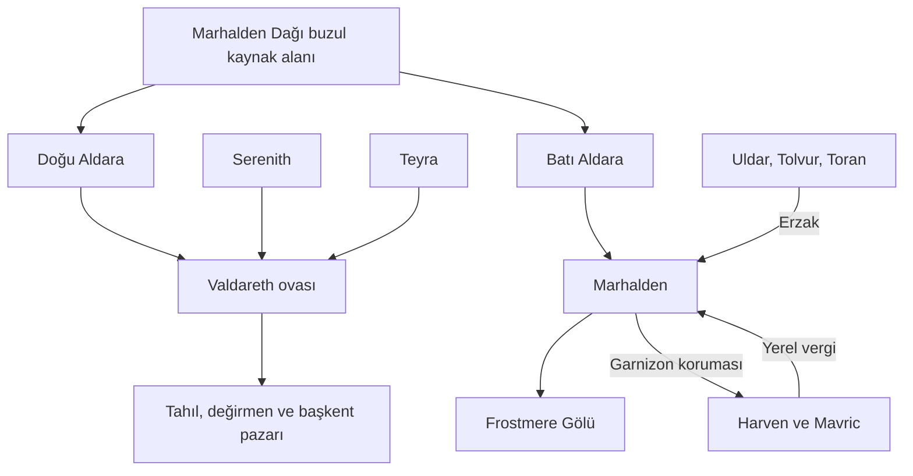

# Valdareth, Karlan ve Marhalden — genişletilmiş lore

7 Ekim 2026. **Yazar çalışma belgesi.** Darbe öncesi; Eryndorn tahtta. Bu dosya kullanıcı kararlarını, yetkilendirilmiş yeni yazımı ve açık ayrıntıları ayırır. Aşağıdaki şehir ve doğa metinleri halka açık wiki için hazırlanmıştır; önceki belgelerdeki görev sırları bunlara eklenmemiştir.

**8 Ekim güncellemesi:** Bu belge Valdareth/Karlan/Marhalden çalışmasının 7 Ekim sürümüdür. Yeni Hardlane şehirleri ve reformları [HARDLANE.md](HARDLANE.md) içinde: Dranthol güçlü kraliyet garnizonu, Ternhaven sınırlı yatırım istisnasıdır; Kaldmere beşinci şehir olarak kesinleşti. Genel zayıf yönetim ve Harven/Mavric bağı devam eder. Kemiğe Basan Yol, mevcut Marhalden eşiğine dayanan gayriresmî hattır; ikinci güvenli dağ geçidi değildir.

## Bilginin dayanağı

### Kullanıcının doğrudan verdiği bilgiler

- **Valdareth:** Çok yüksek nüfuslu, düzensiz büyümüş, beş ana sur kuşağı ve birçok iç savunması olan başkent. İçten dışa servet ve hizmet azalır; en dış yerleşim köye benzer. Kraliyet sarayı/kalesi ve siyah obsidyen kaplı kilise en iç duvarlardadır. Eski büyük deniz feneri ve limanı ayıran koruyucu duvar vardır.
- **Ova ve üretim:** Serenith, Aldara ve Teyra Valdareth ovasını besler. Çok büyük, verimli tarım alanları ve yel değirmenleri uzaklara uzanır. Valdareth en kalabalık şehirdir; kesin nüfus verilmedi.
- **Kiremit:** Mavi mor kiremit önce saraylarda kullanıldı. Renk malzemesi Dorvenhall'dan gelir; işlenmesi iki şehirde yapılır.
- **Kurumlar:** Başkent büyük hapishaneye, kralın özel birliğine, şehir muhafızlarına, ÇelikKalkan'a ve diğer loncalara ev sahipliği yapar. Mor Donanma güvenli Rilorn Körfezi'nde bekler.
- **Doğrudan vergi:** Pilorn, Fehar, Gaalmire, Naeron, Fevric, Theld, Korhenden → Valdareth / kraliyet.
- **Karlan:** Hardlane'i Manorveil ve Lowvale'den ayıran sarp sıra; en yüksek zirve 13.000 metre. Kuzey Velthar ve Brolin Körfezi'ne bakar. Orta ve en küçük büyük kütle Marhalden Dağı'dır; Aldara buradan doğar. Güney kütlesi Harven ve Tolvur çevresine bakar.
- **Aldara kararı:** Kullanıcı yön farkı sorusuna **iki kol** seçeneğini verdi. Doğu Aldara ovayı, Batı Aldara Marhalden üzerinden Frostmere'i besler. İki kol aynı buzul kaynak alanından çıkar; tek nehrin havza ayrımını yokuş yukarı aştığı varsayılmaz.
- **Nadir maden:** Karlan dışında doğal yatağı bulunmayan, demirden hafif ve çok dayanıklı, son derece nadir silah/zırh malzemesi. İsim oluşturma yetkisi verildi.
- **Ulaşım:** Hardlane'e bilinen düzenli kara geçişi Marhalden'dir. Eski maden geçişleri az kişi tarafından bilinir; kuzey/güney kaçak patikaları çok az başarı sağlar. Kralın/Kraliçenin Yolu batıya sürmez.
- **Yerel gelenek ve taç:** Kral lord atayabilir ve azledebilir. Şehirlerin çoğunun Şafak Çağı'ndan beri süren gelenekleri vardır. Marhalden'in gücü lonca çevrelerinden gelir; şehir lordu sekiz, baş lonca üyesi dört yılda bir seçilir.
- **Marhalden:** Çok yüksek nüfuslu değildir. Demir madeni, ocak ve ticarethane çoktur. Tarım neredeyse yoktur; balık boldur ama en büyük sanayi balıkçılık değildir. Temiz su, güçlü duvar, yüksek güvenlikli zindan, lord ve lonca başı için nehrin karşı kıyılarında iki kale vardır. Küçük, seçkin ve donanımlı askerî birlik, muhafızlar ve küçük kuşatma silahları bulunur.
- **Şehir iklimi:** Kış −35 °C; yaz en fazla 25 °C; ortalama 5–10 °C. Theramis büyücüleri ve Elorwyn ruhbanları iklimi dengelemeye yardımcı olur. Son mülteci akını üzerine şehre mülteci girişi kapatılmıştır.
- **Yerel vergi:** Uldar, Tolvur, Toran, Harven, Mavric → Marhalden. İlk üçü doğuda; elverişli iklim, hayvancılık ve ticaret, şehre erzak. Harven ve Mavric batıda Hardlane içindedir; Marhalden birlikleri baskınlardan korur. Tarım yok; av ve odunculuk, son dönemde köle ticareti ve yağmada ölenlerden alınan ziynet geliri vardır.
- **Frostmere:** Yılın yaklaşık yarısı donuk, yarısı açık su.

### Kullanıcının oluşturma yetkisiyle eklenenler

- Beş sur adı, yedi mahalle adı; azınlık mahallesinin **Kandiller** olması ve çok kökenli nüfusu. Belirli bir azınlığın tarihi suç, gizli taraf veya bütün halkın tek kişiliği yazılmadı.
- **Vaeranth İçkalesi, Kara Ayna Kilisesi, İlk Işık Feneri, Rıhtım Perdesi, Derinkilit.** Kilise Bakır Ana geleneğine bağlandı; siyah cephe gizli kötücül tarikat kanıtı yapılmadı.
- Sekiz saray makamının güncel görevlileri; kralın birliği **Menekşe Muhafızları**. ÇelikKalkan kaynakta vardı; diğer yedi başkent loncası yeni yazım.
- Dorvenhall renk katkısının adı **menekşespatı**. Karlan'ın farklı madeninin adı **Veyralt**; üretim, kalite ve kıtlık ayrıntıları yeni yazım.
- **Veyrakar (13.000 m), Aldarataç (Marhalden Dağı / 8.400 m), Tholkar (11.200 m).** En yüksek değeri kullanıcı verdi; orta/güney sayıları yeni yazım. Şehrin yaklaşık **2.350 m** yerleşim yüksekliği yeni yazım; şehri 8.400 veya 13.000 m zirveye koymuyoruz.
- **Üç Mühür Meclisi** ve kolları **Derin Damar, Akkör Örs, Tartı ve Mühür**. En az iki kol onayı, görevlerin aynı kişide birleşmemesi ve lord adayının kraliyet beratı alması yeni uygulama usulü. Seçim süreleri kullanıcı kararı.
- Güncel Marhalden lordu **Edran Korr**, baş lonca üyesi **Başusta Vessa Thol**; iki kale **Doğu Mühür Kalesi / Batı Örs Kalesi**, aralarında **Mühür Köprüsü**, zindan **Sessiz Kilit**, birlik **Eşik Mızrakları**.
- **Dört Ocak Çemberleri:** Yerel, yakıt ve bakım isteyen sıcaklık/koruma düzeni. Bütün dağ iklimini değiştirmez; büyü uygulayan ruhban ve büyücüler ruhsat hukukuna bağlıdır.
- Sekiz canlı, ölçüleri, yükselti kuşakları ve davranışları; vergi köylerinin ayrıntılı ürün uzmanlıkları yeni yazım.

## Tutarlılık kararları ve açık ayrıntılar

1. **Harven/Mavric istisnası:** Önceki Hardlane geneli için “düzenli vergi işlemez, Frostbay çoğunlukla kâğıt üzerinde idare eder” kararı korunur. Yeni kullanıcı ayrıntısı bu iki köyü Marhalden'in fiilî garnizon ve vergi ağına özel bağlı yerler yapar. Frostbay diğer yerler için kâğıt üstü merkezdir; bütün Hardlane güçlü yönetime kavuşmuş sayılmaz.
2. **Geçidin anlamı:** Marhalden tek bilinen düzenli **kara** geçişidir. Hardlane'in mevcut deniz yerleşimleri silinmez. Yerel garnizon patikaları kralın bakımlı ana yolunun devamı sayılmaz.
3. **Dağ ekolojisi:** 13.000 metre dorukta kalıcı keçi sürüsü veya insan şehri yazılmadı. Canlılar daha aşağı kuşaklarda; sıra dışı mağara türleri sıcak/organik besin bulunan küçük alanlarda yaşar.
4. **Savunma ünü:** “Alınmaz Eşik” kentin ünü. Güçlü savunma erzak kesilmesini, iç ayrışmayı ve siyaseti fiziksel olarak imkânsız kılan bir büyüye dönüştürülmedi.
5. **Yer adları:** Yeni yazım **Serenith, Teyra, Uldar, Tolvur, Toran, Harven, Gaalmire** kullanır. Eski harita incelemesinde Serenth, Terra, Ildar, Tora, Galmire ve örtülü Tolva/Har…en okumaları vardı. Olası eş adlar envanterde gösterilir; küçük yerlerin aynı nokta olduğu varsayılıp pin konmaz. **Pilorn ≠ Rilorn**; **Fehar ≠ Frethar** ve **Korhenden ≠ Korthen** için de otomatik birleştirme yapılmaz.
6. **Bölge aidiyeti:** Marhalden kentinin resmî Manorveil/Lowvale sınır aidiyeti, vergi köylerinin tüm koordinatları ve lordluk sınır çizgisi henüz kesinleşmedi. Vergi bağı coğrafi bölge adı yerine kullanılmaz.
7. **Açık hukuk:** Köle ticaretinin varlığı kullanıcı kararıdır; tüm Danstsud'daki yasal statüsü, korunan mağdurların hakları ve lordun bilgisi henüz seçilmedi. Kamu metni ticaretin varlığını ve insanlara yükünü anlatır; görünmeyen suç ortaklığı sonucu üretmez.
8. **Sarayın eski sırları:** Alisande'nin kayıp kraliçe anlatısıyla ilişkisi, veraset ve Tharion–Damian akrabalığı bu şehir genişlemesiyle çözülmüş değildir. [Aile belgesi](HANEDANLAR_VE_BUYU_HUKUKU.md) geçerlidir.
9. **Ölçek:** Kesin başkent nüfusu, dünya takvimi seçiminin yılı, vergi oranı ve kent yüzölçümü uydurulmadı. Marhalden nüfusça küçük ama stratejik olarak başlıca şehirlerden biridir.

## Su ve geçim şeması

Bu şema ilişkileri gösterir; harita üzerinde ölçülmüş bir güzergâh değildir.

## Kamuya açık genişletilmiş metinler

Aşağıdaki tam metinler, halka açık wiki kayıtlarının bu tarihteki yazımıdır. Yeni isimlerin dayanağı yukarıda ayrı belirtilmiştir.

## Valdareth

### Beş surun başkenti

Valdareth, Danstsud’un en kalabalık şehridir. Vaeranth sarayının çevresinde büyüyen başkent, birbirine eklenen evler, iç kaleler, kesilen sokaklar ve eski surların içine sıkışmış pazarlarla gelişmiştir. Bir mahallede üst katlar sokağın üzerinde birleşirken başka bir yerde sebze tarlası eski bir burcun dibine kadar gelir.

Şehri dıştan içe beş ana sur kuşağı korur. Bunlar düzgün çizilmiş eş merkezli çemberler değildir: eski savunma hatları, dere yatakları ve mülkiyet sınırları birbirine eklenmiştir. Kuş bakışı bakıldığında genel düzen açıktır; içeriye yaklaştıkça saray zenginliği ve güvenlik, dışarıya gidildikçe yoksulluk ve hizmet eksikliği artar.

| İçten dışa | Sur | Başlıca mahalle | Kent yaşamı |
| --- | --- | --- | --- |
| 1 | Taç Duvarı | Taçyamaç | Saray, iç kale, Kara Ayna Kilisesi |
| 2 | Mühür Duvarı | Morkiremit | Soylu konakları, saray görevlileri, elçi evleri |
| 3 | Lonca Duvarı | Örsyaka ve Kandiller | Atölyeler, lonca avluları, çok dilli ticaret |
| 4 | Pazar Duvarı | Balçıkmerdiven ve Feneraltı bağlantısı | Kalabalık kiracı evleri, büyük pazarlar, liman emeği |
| 5 | Saban Duvarı | Sabançeper | Köy dokusu, ahırlar, küçük bostanlar ve değirmen yolu |

### İç kale, obsidyen kilise ve eski fener

En iç savunma hattında Vaeranth İçkalesi ile siyah obsidyen kaplı Kara Ayna Kilisesi bulunur. Kilisenin koyu cephesi gün ışığını keskin parçalara böler; Bakır Ana’ya adanmış bakır kapılar ve kandiller bu karanlık taşın önünde parlar. Kilisenin siyah görünümü, başkentin koruyucu inancının görsel dilidir.

Çok eski ve büyük İlk Işık Feneri, limanın yön bulma noktasıdır. Denizciler kıyıya yaklaşırken önce onun ışığını, sonra şehrin üst üste yığılmış çatılarını görür. Fenerin nöbeti, yakıtı ve merceğinin bakımı liman idaresinin düzenli yükümlülüğüdür; kuruluş tarihi kesin bir yıl olarak bilinmez.

Liman ile kara mahallelerini ayıran Rıhtım Perdesi, yük kapıları ve gözetleme burçları olan koruyucu bir duvardır. Bu kıyı savunması, beş ana sur kuşağının arasında limanın kendine özgü sınırını oluşturur. Yüklerin ve insanların birkaç geçişte toplanması, hem gümrüğe hem kaçakçılığa değer kazandırır.

### Vaeranth ailesi ve saray

Eryndorn’un babası Caedren Vaeranth önceki hükümdardır; Caedren ve kraliçe Isolde ölmüştür. Saray ailesinde Eryndorn’un eşi Kraliçe Alisande, küçük kız kardeşi Leydi Mirelda ve kızı Prenses Ilyenne yer alır.

Alisande’nin uğraşı sarayın erzak, yardım ve harcama ihtiyaçlarıdır. Mirelda hanedanı lord aileleriyle yapılan görüşmelerde temsil eder; Ilyenne yönetim, kayıt ve hukuk öğrenir. Bu aile rolleri, devlet makamlarının bütün yetkilerinin aile üyelerine ait olduğu anlamına gelmez.

Eryndorn’un bilinen bir erkek varisi yoktur. Ilyenne halka açık meşru çocuğudur; bu konum onu kendiliğinden ilan edilmiş veliaht yapmaz. Tahtın geleceği, lordlukların başkentle ilişkisini de etkiler.

### Sarayın işleyen makamları

Başmühürdar Orren Vask kraliyet emirlerini ve lordluk beratlarını, Hazinedar Maelis Dervan krala gelen vergiyi ve borçları, Başkent Vekili Teren Halvek mahalle hizmetleri ile şehir muhafızlarının sivil görevlerini takip eder. Bir emrin yazılması, bedelinin karşılanması ve sokakta uygulanması farklı ellerden geçer.

İaşe Nazırı Sera Neld tahıl ambarları ve ekmek arzından, Liman Nazırı Doran Kest gümrük ve rıhtımlardan sorumludur. Sicil Nazırı Lethan Orve büyü ruhsatlarının merkez kaydını yürütür. Makamlar arasında en sık anlaşmazlık, sarayın önceliği ile kentin gündelik ihtiyacının aynı kaynağı istemesiyle çıkar.

### Üç nehrin ovası

Serenith, Doğu Aldara ve Teyra, Valdareth ovasını besler. Verimli topraklar şehir sınırlarının çok ötesine uzanır; tahıl tarlaları, bostanlar, otlaklar ve yel değirmenleri başkenti çevreleyen geniş bir üretim kuşağı oluşturur. Dış mahallelerin köy görünümü, bu tarım dünyasının sur içine kadar gelmesinin sonucudur.

Tahıl köy ambarından değirmene, değirmenden fırına ve pazara taşınır. Suyun kullanılabildiği kesimlerde nehir mavnaları, geri kalan yollarda öküz arabaları çalışır. Pazar kapılarındaki tartı kayıtları ürünün miktarını, sahibini ve vergi hesabını gösterir.

Şehir zengin bir ovada bulunsa da ucuz ekmek kendiliğinden sağlanmaz. Taşkın, ambar kaybı, değirmen onarımı veya geçişlerde bekleyen arabalar aynı hafta içinde fiyatı yükseltebilir. En iç sarayda un stoku sürerken Balçıkmerdiven’de ekmek kuyruğunun uzaması, başkentin eşitsizliğini görünür kılar.

### Mavi mor kiremidin doğuşu

Mavi mor kiremitler ilk kez Valdareth saraylarında kullanılmıştır. Renk veren mineral Dorvenhall’dan gelir; mineralin arıtılması, sır hazırlanması ve kiremidin pişirilmesi Dorvenhall ile Valdareth’te yapılır. Ustalar bu katkıya menekşespatı der.

Taçyamaç’ın damları ışık altında maviden mora değişirken Morkiremit’te daha küçük konaklar aynı görünümü tekrarlar. Pahalı sırın taklitleri dış pazarlara kadar ulaşır. Bir çatının rengi, onu taşıyan ailenin servetini gösterebilir; solmuş ucuz boya aynı dayanıklılığı sağlamaz.

Dorvenhall menekşespatı ile Karlan’ın Veyralt cevheri farklı madenlerdir. Kiremit üretimi, başkentin zanaat ve taşımacılık ekonomisine; Veyralt ise Marhalden’in nadir silah metaline bağlıdır.

### Liman, Rilorn ve Mor Donanma

Feneraltı’nda halatçılar, yük taşıyıcıları, yelkenciler, balık satıcıları ve han sahipleri limanın iş gününü paylaşır. Şehir limanı ile güvenli Rilorn Körfezi birbirine bağlı, ayrı işlevleri olan yerlerdir. Mor Donanma körfezde bekler; başkent rıhtımları gündelik yük ve yolcu trafiğini taşır.

Donanmanın iaşesi tahıl, tuzlu et, kereste, yelken ve halat ister. Bu talepler şehirde iş yaratırken aynı malzemeler için sivil atölyelerle rekabet eder. Körfezin güvenliği deniz ticaretini destekler; bir deniz kuvvetinin varlığı bütün tüccar gemilerini sürekli açık denizde koruduğu anlamına gelmez.

### Kraliyetin vergi havzası

Pilorn, Fehar, Gaalmire, Naeron, Fevric, Theld ve Korhenden’in vergisi Valdareth’e, doğrudan krala gelir. Başkent bu yerleşimlerin ürününü, yol bağlantılarını ve insan emeğini geniş iaşe düzeninin içinde kullanır.

Tahıl ve hayvan gibi aynî tahsilat, ambar kaydına girer; para olarak gelen gelir hazinede tutulur. Aynı ürünün kent kapısında yeniden vergiye dönüşmesini önlemek için ilk tahsilatın kaydı taşınır. Vergi miktarı, bütün köyler için tek bir oran olarak belirlenmemiştir.

### Loncaların başkenti

ÇelikKalkan’ın yanında Mor Sır, Yedi Ambar, Üç Nehir, Fener Halatı, Taş ve Kemer, Açık Defter ve Şifacı Ocağı loncaları çalışır. Birlikte askerî hizmeti, kiremit üretimini, ekmeği, su yollarını, limanı, inşaatı, kayıtları ve bakımı sürdürürler.

Loncalar usta yetiştirir, işin ölçüsünü belirler ve kendi üyelerini temsil eder. Saray bir duvarı onarmak istediğinde Taş ve Kemer’e, ambarları doldurmak istediğinde Yedi Ambar’a ihtiyaç duyar. Kentteki güçlü kurumlar bu yüzden yalnızca soylu aileler değildir.

### Muhafızlar ve Derinkilit

Kralın özel birliği Menekşe Muhafızlarıdır; Ser Caelis Rhovan komutasında hükümdarı ve en iç saray geçişlerini korur. Berric Thane’in şehir muhafızları kapılar, pazarlar, nöbetler ve mahalle güvenliğiyle ilgilenir. ÇelikKalkan ayrı bir loncadır; bütün askerî kurumlar aynı emir zincirine sahip değildir.

Büyük hapishane Derinkilit, şehir baskısının en ağır görüldüğü kurumlardandır. Mahkûmlar, göçmenler ve düşmüş soyluların karşılaştığı kalabalık ve kötü koşullar, dış mahallelerde yakından bilinir. Hapishane idaresi ile bir kişiyi hükümle cezalandıran makam aynı görev değildir.

Sur kapılarında hizmet belgesi, gece nöbeti ve yük geçişi farklı kurallara bağlanır. İçeriye yaklaştıkça güvenlik kontrolleri artar; dış mahallelerde bir devriyenin gecikmesi günlük hayatı çok daha kolay kesintiye uğratır.

### Kraliyet Büyü Sicili

Büyü ruhsatlarının merkez kaydı Valdareth’te tutulur. Sicil uygulayıcının kimliğini, eğitimini doğrulayan kurum veya ustayı ve izin verilen hizmet alanını kaydeder. Eğitim belgesi ile uygulama ruhsatı ayrı işlemlerdir.

Ruhsatlı büyücü okul dışında da izin kapsamındaki hizmeti verebilir. İzinsiz uygulama ve kurban ritüelleri yasaktır. Lonca veya kilise üyeliği tek başına uygulama izni değildir; başkentin kalabalığı bu kuralın her sokakta kusursuz uygulanmasını sağlamaz.

### Başkentin günü ve kırılganlığı

Şafakta Sabançeper’den ürün arabaları gelir, öğleye doğru Örsyaka’nın ocakları en sıcak saatine ulaşır, akşam Feneraltı’nda yük payları hesaplanır. Kandiller’de aynı sokakta farklı dillerde alışveriş yapılır. Taçyamaç’ın sessiz avluları bu kalabalıktan birkaç duvar ötede kalır.

Tıkalı giderler, ahşap katlarda yangın, taşkınlar ve kira artışı farklı mahalleleri farklı biçimde etkiler. Eski surların kapıları bir yangında tahliye yolunu daraltabilir. Başkentin gücü geniş tarlalarından, limanından ve kayıt düzeninden gelir; bu kaynakların insanlara nasıl ulaştığı ise sürekli bir siyasi anlaşmazlıktır.

## Marhalden

### Kralın yolunun eşiği

Marhalden, Karlan’ın üç büyük zirvesinin ortadaki en küçük olanı Marhalden Dağı’nın geçit kuşağında kurulmuş, nüfusu çok yüksek olmayan bir kale şehridir. Şehir yaklaşık 2.350 metre yüksekliktedir; dağın zirvesi ile şehrin yerleşim yüksekliği farklıdır.

Hardlane’e ulaşan bilinen tek düzenli kara yolu buradan geçer. Kralın Yolu, Marhalden’de sona erer; batıya kraliyet veya kraliçe adına sürdürülen yol ağı uzanmaz. Dağı aşan yerel izler ve garnizon patikaları, sürekli bakılan bu yolun devamı değildir. Deniz yolculuğu başka bir ulaşım biçimi olarak varlığını korur.

Eski madenlerden geçen bağlantılar az kişi tarafından bilinir ve güvenilir değildir. Çöküntü, buz tıkacı ve kirli hava, açılan bir galeriyi sonraki mevsimde kapatabilir. Kuzey ve güney patikalarını kaçak geçiş için deneyenlerin çok azı başarır; yük arabalarının düzenli geçişi yine Marhalden’e bağlıdır.

### Aldara ve iki kale

Marhalden Dağı’nın ortak buzul kaynağından çıkan Doğu Aldara ovayı, Batı Aldara ise Marhalden’i geçip Frostmere Gölü’nü besler. Şehirde lordun Doğu Mühür Kalesi ile baş lonca üyesinin Batı Örs Kalesi, Batı Aldara’nın karşılıklı kıyılarında bulunur.

Kaleler arasındaki Mühür Köprüsü hem yük geçişini hem yönetici makamların görüşmesini taşır. Nehrin iki yakasındaki yönetim, tek kaleye çekilmiş bir iktidara dönüşmez. Lordun askerî ve idari yetkisi ile loncanın ocak, usta ve ticaret üzerindeki etkisi ayrı odaklarda görünür.

Temiz içme suyu buzul kaynakları ve yukarıdan alınan korunmuş su hatlarıyla sağlanır. Maden yıkama ve ocak atığı içme suyunun alındığı kesime verilmez; bu ayrımın bakımı şehrin yaşaması için gereklidir.

### Üç Mühür yönetimi

Marhalden lordları güçlerini şehirdeki loncalardan alır. Madenin kazılması, işlenip şekillendirilmesi ve satılması, nesiller boyunca uzmanlaşmış üç ayrı kolun işidir. Küçük lordlar ve aristokratlar bu kolların üretim ve mülkiyet çevresinden çıkar.

Bu çevreler şehir lordunu sekiz yılda bir, baş lonca üyesini dört yılda bir seçer. Güncel lord Kazı kolundan Edran Korr, baş lonca üyesi İşleme kolundan Başusta Vessa Thol’dur. Makamların farklı süreleri ve farklı ellerde tutulması, tek kolun bütün sistemi yönetmesini zorlaştırır.

Danstsud kralı bir lordu atayabilir veya makamdan alabilir. Marhalden’in seçim geleneği, kraliyet beratının yerini tamamen almaz: şehir adayını çıkarır, taç lordluk yetkisini tanır. Kralın geleneği çiğneyerek dışarıdan birini dayatması hukuki gücünü kullanır; loncaların iş birliğini kendiliğinden sağlamaz.

### Demir, Veyralt ve ocak emeği

Demir madenleri, ocaklar, şekillendirme atölyeleri ve ticarethaneler Marhalden’in gündelik ekonomisini taşır. Karlan’da bulunan, evrenin başka yerinde doğal yatağı bilinmeyen çok nadir Veyralt cevheri şehre ayrı bir stratejik değer kazandırır.

Veyralt’tan elde edilen metal, demirden hafif ve çok dayanıklıdır; seçkin zırh ile silah yapımında kullanılır. Cevherin azlığı, işlenmesinin güçlüğü ve hatalı bir partinin büyük kayba yol açması fiyatını yükseltir. Şehrin bütün demircileri bu metalden sıradan çivi veya gündelik araç üretmez.

Kazıcıların işi galerilerin güvenliğiyle, ustaların işi ocak ve kaliteyle, tüccarların işi ölçü ve satışla bağlıdır. Bir kol tek başına bütün üretim zincirini tamamlayamaz. Aynı bağımlılık ücret, fire ve teslimat anlaşmazlıklarını da doğurur.

### İklim çemberleri ve sert mevsimler

Marhalden’de kış sıcaklığı −35 °C’ye inebilir; yazın üst sınır yaklaşık 25 °C, ortalama sıcaklık 5–10 °C civarındadır. Bu değerler bütün Karlan doruklarını değil, yerleşim yaşamını anlatır.

Theramis’in ruhsatlı büyücüleri ile Elorwyn’in ruhbanları, Dört Ocak Çemberleri denen koruma düzenini geliştirmiştir. Ocak ısısını tutan taşlar, rüzgârı kıran işaretler ve donmayı geciktiren su geçişleri, kaleler, işlikler ve kapı avlularında yaşanabilir cepler sağlar.

Çemberler dağın bütün iklimini değiştirmez. Yakıt, ustalık ve düzenli bakım ister; bir işaret bozulduğunda o avlu hızla soğur. Ruhbanların dua ve bakım işi ile gerçek büyü uygulaması ayrılır; büyü yapan görevliler aynı ruhsat hukukuna bağlıdır.

### Erzak, balık ve vergi köyleri

Tarım şehirde neredeyse yapılmaz. Uldar, Tolvur ve Toran dağların doğusunda, daha elverişli iklimde hayvancılık ve ticaret yapabilen yerlerdir; Marhalden’in tahıl, hayvan, süt ürünü ve kervan erzağı bu yönden gelir.

Batıda Hardlane içinde bulunan Harven ve Mavric, Marhalden’in vergi topladığı ve birlik konuşlandırdığı iki yerleşimdir. Tarım bulunmaz; avcılık ve odunculuk önemlidir. Son dönemde köle ticareti ile yağmada ölenlerden alınan ziynetlerin satışı da gelir kaynakları arasına girmiştir. Bu ticaretin yükünü esir edilen insanlar taşır.

Aldara’da bol balık bulunabilir; balıkçılık ev geçimine katkı verir, fakat maden ve metal ticaretinin yerini alan en büyük sanayi değildir. Kış ambarları ve doğu kervanları aksadığında sağlam surlar tek başına insanları doyurmaz.

### Eşik Mızrakları ve Sessiz Kilit

Eşik Mızrakları, şehrin küçük fakat seçkin ve iyi donanımlı askerî birliğidir. Geçit muhafızlarıyla birlikte dar yaklaşım yollarını, köprüleri ve ocak sevklerini korur. Küçük taş atıcılar ve döner kundaklı ağır arbaletler, duvar ve dar yol savunmasına göre hazırlanmıştır.

Kalın duvarlar, sarp arazi, temiz su ve karşılıklı iki kale şehri doğrudan hücumla ele geçirmeyi olağanüstü zorlaştırır. Halkın “Alınmaz Eşik” demesi bu savunmanın ünüdür. Uzun iaşe kesintisi ve içerideki siyasi bölünme, duvarın kalınlığından farklı sorunlardır.

Yüksek güvenlikli Sessiz Kilit zindanı, iki makamdan ayrı kayıtları tutulan bir muhafaza kurumudur. Kimin tutulduğu ve hükmün hangi makamdan geldiği kaydedilir; zindanın güçlü kilitleri adil yargılamanın kendiliğinden sağlandığını göstermez.

### Kapatılan kapılar

Son dönemdeki mülteci akını üzerine Marhalden şehir kapılarını mülteci girişine kapatmıştır. Kapanma kararı, iaşe kervanlarının ve mevcut ticaretin bütünüyle durdurulması anlamına gelmez; kapıda insanların statüsüne göre farklı muamele yapılır.

Kapı dışındaki bekleyiş, batıdaki savunmasız toplulukların kaderini şehrin ambar ve işçi tartışmalarına bağlar. Loncalar iş gücü ararken yönetim stok ve güvenlik kaygısını öne çıkarır. Seçkin savunma ile korunmaya kabul edilen insanların dar tutulması, Marhalden’in güncel siyasi çatışmasıdır.

## Valdareth Mahalleleri

Taçyamaç’tan Sabançeper’e uzanan başkent mahalleleri. Valdareth’in düzensiz büyümesi, içten dışa azalan servet ve hizmetle birlikte görülür; Kandiller farklı kökenlerden azınlık topluluklarının yerleştiği mahalledir.

### Beş surun başkenti

Valdareth, Danstsud’un en kalabalık şehridir. Vaeranth sarayının çevresinde büyüyen başkent, birbirine eklenen evler, iç kaleler, kesilen sokaklar ve eski surların içine sıkışmış pazarlarla gelişmiştir. Bir mahallede üst katlar sokağın üzerinde birleşirken başka bir yerde sebze tarlası eski bir burcun dibine kadar gelir.

Şehri dıştan içe beş ana sur kuşağı korur. Bunlar düzgün çizilmiş eş merkezli çemberler değildir: eski savunma hatları, dere yatakları ve mülkiyet sınırları birbirine eklenmiştir. Kuş bakışı bakıldığında genel düzen açıktır; içeriye yaklaştıkça saray zenginliği ve güvenlik, dışarıya gidildikçe yoksulluk ve hizmet eksikliği artar.

| İçten dışa | Sur | Başlıca mahalle | Kent yaşamı |
| --- | --- | --- | --- |
| 1 | Taç Duvarı | Taçyamaç | Saray, iç kale, Kara Ayna Kilisesi |
| 2 | Mühür Duvarı | Morkiremit | Soylu konakları, saray görevlileri, elçi evleri |
| 3 | Lonca Duvarı | Örsyaka ve Kandiller | Atölyeler, lonca avluları, çok dilli ticaret |
| 4 | Pazar Duvarı | Balçıkmerdiven ve Feneraltı bağlantısı | Kalabalık kiracı evleri, büyük pazarlar, liman emeği |
| 5 | Saban Duvarı | Sabançeper | Köy dokusu, ahırlar, küçük bostanlar ve değirmen yolu |

### Taçyamaç: ilk kapının ardı

Taçyamaç, Taç Duvarı’nın içindeki saray ve iç kale çevresidir. Dışarıdaki kalabalık burada avlular, taş merdivenler ve kontrol edilen geçişlere ayrılır. Menekşe Muhafızlarının nöbeti, kraliyet ailesinin mekânını kentin geri kalanından ayırır.

Vaeranth İçkalesi ile Kara Ayna Kilisesi aynı en iç savunma hattını paylaşır. Birbirine yakın olmaları, rahiplerin saray memuru veya saray memurlarının ruhban olduğu anlamına gelmez. Mavi mor saray çatıları bu kuşağın uzak mesafeden görülen işaretidir.

### Morkiremit: servetin görünür yüzü

Mühür Duvarı içindeki Morkiremit’te büyük konaklar, elçi evleri, yüksek saray görevlilerinin haneleri ve pahalı çatı ustaları bulunur. Sokaklar dış mahallelere göre daha iyi temizlenir; buna rağmen eski bir mülkiyet sınırı geniş caddeleri beklenmedik bir çıkmaza dönüştürebilir.

Mahallenin adı saray çatılarının taklidinden gelir. Bir aile konuklarını damın renginin en iyi göründüğü avluda karşılayabilir. Aynı iş için iç kuşağa giren çırak, geceyi çoğu zaman dıştaki kiracı evinde geçirir.

### Örsyaka: lonca avluları

Lonca Duvarı çevresindeki Örsyaka’da demir, kil, kiremit ve taş ustalarının avluları bulunur. Ocakların ısısı, teslimat arabaları ve çırakların paylaştığı yatakhaneler mahalleyi sabah erken saatten geceye kadar hareketli tutar.

İş yerlerinin üstünde yaşayan aileler için üretim ile ev hayatı ayrılmaz. Lonca avlusu bir ustanın koruma ağı olabilir; loncaya giremeyen gündelikçi aynı sokakta çok daha güvencesiz çalışır. Saraya giden güzel kiremidin kırık ve hatalı parçaları burada yapı onarımında değerlendirilir.

### Kandiller: azınlıkların çok dilli mahallesi

Kandiller, üçüncü kuşağın büyük pazarla birleştiği yerde, başkentin azınlık topluluklarının yoğun yaşadığı mahalledir. Honud kökenli aileler, Murgullu denizci haneleri, Arikili tüccarlar ve Danstsud’un farklı bölgelerinden gelen işçiler aynı mahallede bulunur; bütün sakinler tek bir halk değildir.

Dar sokaklarda başka dillerde dükkân levhaları, farklı yemek kokuları ve ortak avlularda paylaşılan kandiller görülür. Çevirmenlik, kumaş, küçük zanaat, yemek ve liman işi geçim sağlar. Yeni gelenler akraba evinde yatak bulabilir; eski sakinlerin dükkânları ve birikimleri de vardır.

Mahalle adı sakinlerin milliyetine veya tek bir dine bağlanmaz. Kara Ayna Kilisesi’ne gidenler kadar kendi geleneklerini koruyan haneler de yaşar. Kira baskısı ve ayrımcı muamele ortak sorunlar olabilir; suç veya siyasi bağlılık bir kökene topluca yüklenmez.

### Balçıkmerdiven: kalabalığın yükü

Pazar Duvarı’nın içindeki Balçıkmerdiven’de evler kat kat yükselir, sokak basamakları yağmurda çamurlu su taşır. Aynı yapı bir fırın, kiralık odalar ve arka avludaki küçük hayvan barınağını birlikte tutabilir. Şehrin yüksek nüfusu burada dar bir alana sıkışır.

Gündelikçiler, küçük satıcılar ve taşıyıcılar erken kapı kuyruğuna girer. Hastalık, yangın veya çalışılamayan birkaç gün bir hanenin borcunu hızla büyütür. Mahallede yardım ocakları ve komşuluk bağları vardır; bunların varlığı yoksulluğun yükünü ortadan kaldırmaz.

### Feneraltı: limanın iş günü

Feneraltı, İlk Işık Feneri ve liman geçişleri çevresindeki işçi mahallesidir. Rıhtım Perdesi buradaki yaşamı yük kapılarına toplar. Hanlar, halat avluları, tuzlu balık tezgâhları ve antrepolar kıyı boyunca birbirine eklenir.

Mahalle beş sur kuşağına eklenmiş altıncı bir çember değildir. Kıyı duvarları ve eski büyüme hatları onu pazar kuşağına farklı noktalardan bağlar. Limana yaklaşan bir geminin boşaltma sırası, burada yüzlerce kişinin o gün iş bulup bulamayacağını belirler.

### Sabançeper: sur içindeki köy

Saban Duvarı’nın içindeki en dış yerleşim kuşağı Sabançeper’dir. Alçak evler, ahırlar, bostanlar ve toprağı açık avlularla köye benzer. Şehrin haşmetli merkezinden aldığı pay azdır; güvenlik, kaldırım ve temiz su hizmetleri düzensiz ulaşır.

Dış kapıların ötesindeki çok büyük tarım arazileriyle günlük ilişki buradan kurulur. Hasat zamanında geçici yataklar ve küçük depolar dolar. Yel değirmenlerinin kanatları surdan görülebilir; başkent ahalisi için köy sayılan mahalle, kentin yiyeceğini içeri sokan emek dünyasıdır.

## Valdareth Saray Makamları

Eryndorn’un yönetiminde başkent işlerini yürüten makamlar. Kraliyet emri, hazine, mahalle hizmetleri, liman ve büyü sicili ayrı görevlerdir; saray ailesiyle devlet görevi aynı kayıt değildir.

### Tahtın günlük idaresi

Kral nihai siyasi otoriteyi taşır; günlük işlerin farklı görevlilere dağılması onun emirlerinin şehir içinde uygulanmasını sağlar. Saray makamının serveti ve etkisi, görevinin bütün başka makamları yönetmesiyle aynı şey değildir.

| Makam | Görevli | Sorumluluk |
| --- | --- | --- |
| Başmühürdar | Orren Vask | Kraliyet emirleri, lordluk beratları ve mühür kaydı |
| Hazinedar | Maelis Dervan | Vergi geliri, borç ve harcama kaydı |
| Başkent Vekili | Teren Halvek | Mahalle hizmetleri, pazar düzeni ve sivil idare |
| İaşe Nazırı | Sera Neld | Ambar, değirmen ve ekmek arzı |
| Liman Nazırı | Doran Kest | Gümrük, rıhtım ve fener bakımı |
| Sicil Nazırı | Lethan Orve | Kraliyet Büyü Sicili ve ruhsat kayıtları |
| Menekşe Muhafızları Komutanı | Ser Caelis Rhovan | Kralın şahsi güvenliği ve iç saray |
| Şehir Muhafızları Komutanı | Berric Thane | Kapılar, devriyeler, pazar ve kent nöbetleri |

### Mühür ile hazine arasındaki mesafe

Orren Vask’ın mühürlediği bir onarım emri, Maelis Dervan’ın önünde ödeme sorusuna dönüşür. Hazinedar ürünün veya paranın gerçekten geldiğini kaydeder; bir köyün beklenen vergisi elde bulunan gelir sayılmaz. Başmühürdar ise bir lordun kişisel dileğini kraliyet emriymiş gibi kayda geçiremez.

Bu ayrım yönetimde gecikme ve çekişme doğurur. Lonca teslim ettiği işin ücretini ister, hazine önceki borcu gösterebilir, saray yeni duvarın derhal bitirilmesini talep edebilir. Kayıt tutan kişiler bu çatışmayı ortadan kaldırmaz; nasıl yaşandığını görünür kılar.

### Şehir ve iaşe

Teren Halvek’in görevi, saray avlusunun ötesindeki şehir hizmetlerinin düzenidir. Sera Neld ekmek arzını, stokları ve kapılardaki ürün akışını izler. Sel sonrası bir yolu açmak hem vekilin işini hem iaşe nazırının ambar planını etkiler.

Alisande’nin saray yardımıyla ilgilenmesi, bütün tahılın şahsi mülkü olduğu anlamına gelmez. Saray yardımı, kent stokları ve tüccar malı ayrı hesaplarla izlenir. Böylece kime yardım edildiği kadar yardımın nereden karşılandığı da tartışılabilir.

### Liman, sicil ve askerî görevler

Doran Kest’in liman idaresi, Mor Donanmanın denizdeki komutasından farklıdır. Donanmanın Rilorn Körfezi’nde beklemesi, gümrük tartısının bir donanma subayına ait olduğu anlamına gelmez. Liman idaresi feneri ve rıhtımı; deniz kuvveti gemilerini ve askerî görevini yürütür.

Lethan Orve kayıtlı büyücüleri ve izin kapsamlarını izler. Caelis Rhovan krala, Berric Thane şehir güvenliğine komuta eder. ÇelikKalkan ile yapılan hizmet anlaşmaları bu makamların görevini tek loncada toplamaz.

## Valdareth Loncaları

ÇelikKalkan ile birlikte çalışan yedi yeni lonca: Mor Sır, Yedi Ambar, Üç Nehir, Fener Halatı, Taş ve Kemer, Açık Defter ve Şifacı Ocağı. Kentin üretimi ve iaşesi bu uzmanlıklara dayanır.

### Başkentin sekiz loncası

ÇelikKalkan askerî loncadır; diğer yedi lonca kentin farklı hizmet ve üretim alanlarında çalışır. Ustalık ve üyelik, sarayın doğrudan devlet göreviyle aynı şey değildir.

| Lonca | İş ve etki alanı |
| --- | --- |
| ÇelikKalkan | Askerî eğitim, teçhizat ve sözleşmeli hizmet |
| Mor Sır | Menekşespatı, sır, mavi mor kiremit ve seramik |
| Yedi Ambar | Tahıl depolama, değirmenler ve fırınların ürün akışı |
| Üç Nehir | Mavnalar, sulama kanalları, bentler ve su hatları |
| Fener Halatı | Kılavuzluk, halat, yük ekipleri ve liman ustalığı |
| Taş ve Kemer | Duvarlar, köprüler, taş işçiliği ve yapı bakımı |
| Açık Defter | Kâtiplik, sözleşme kopyaları ve ticaret kayıtları |
| Şifacı Ocağı | Hekimlik, ilaç, bakım ve ruhsatlı büyüyle tedavi |

### Mor Sır ve Dorvenhall bağlantısı

Mor Sır, Dorvenhall’dan gelen renk mineralini teslim alır, arıtılmış katkının niteliğini kontrol eder ve fırınlarda kalıcı sır üretir. Mavi mor kiremitlerin saraylardan kente yayılması, bu uzmanlığın itibarıyla birlikte büyümüştür.

Fırınların yakıtı, kırılan partiler ve çırak emeği güzel çatının görünmeyen bedelidir. Valdareth ile Dorvenhall ustaları aynı üretim zincirinde çalışır; hangi aşamanın daha değerli sayıldığı ücret tartışması yaratır.

### Yedi Ambar ve Üç Nehir

Yedi Ambar, adı tarihsel yedi depodan gelen fakat işi yalnızca yedi binayla sınırlı olmayan iaşe loncasıdır. Tahılın nemi, ambar kaybı, değirmen teslimatı ve fırın ihtiyacı aynı hesapta buluşur. Stok bilgisi ekonomik ve siyasi etki sağlar.

Üç Nehir, Serenith, Doğu Aldara ve Teyra’nın kullanımında mavnacıları ve su ustalarını bir araya getirir. Bir bent onarımı ova çiftçisini, şehir kuyusunu ve yük taşımacısını farklı biçimde etkileyebilir. Su kullanımında anlaşmazlık çıktığında loncanın bilgisi önem kazanır.

### Fener Halatı ve Taş ve Kemer

Fener Halatı’nın kılavuzları liman girişini, ekipleri yükün gemiden ambar kapısına yolunu bilir. Halat bakımı, yük payı ve tehlikeli havada çalışma loncanın uzmanlığıdır. İlk Işık Feneri’nin idari sorumluluğu liman nazırında olsa da bakımda lonca ustaları çalışır.

Taş ve Kemer, şehrin eski duvarlarının sürekli yeniden kullanılmasına uyum sağlamıştır. Bir burcun onarımı bitişik evin duvarını da ilgilendirir. Loncanın planları ve taş işçiliği, başkentin düzensiz büyümesini ayakta tutan becerilerdendir.

### Açık Defter ve Şifacı Ocağı

Açık Defter’in kâtipleri satış, ücret ve borç kayıtları hazırlar. Okuyamayan bir işçi için sözleşmenin açıklanması önemlidir. Kraliyet mühürlü devlet emri ile bir lonca kâtibinin ticaret nüshası farklı belgelerdir.

Şifacı Ocağı ilaç, pansuman ve bakım bilgisini paylaşır. Gerçek büyüyle yapılan tedavi için uygulayıcı ruhsatı gerekir; bütün bakım işi büyü sayılmaz. Yoksul mahalleye ulaşan bakım ile zengin konağın satın alabildiği hizmet aynı düzeyde değildir.

### ÇelikKalkan ve sarayın talebi

ÇelikKalkan, askerî eğitim ve hizmet geleneğiyle başkentte bulunur. Kralın özel Menekşe Muhafızları ve şehir muhafızları ayrı yapılardır. Loncanın sarayla hizmet ilişkisi onu kendiliğinden bütün şehir güvenliğinin komutanı yapmaz.

Saray ve Mor Donanma büyük işverenlerdir. Devletin halat, un, çatı veya teçhizat talebi iş açabilir; geciken ödeme ve öncelikli siparişler küçük müşteriyi geriye itebilir. Loncaların siyasi ağırlığı bu maddi ilişkilerden doğar.

## Valdareth Vergi Havzası

Pilorn, Fehar, Gaalmire, Naeron, Fevric, Theld ve Korhenden doğrudan Valdareth’e vergi verir. Verimli ovanın emeği, başkentin yiyecek ve üretim ağına katılır.

### Yedi yerleşimin emeği

Yerleşimlerin öne çıkan işleri, geniş ova üretiminin parçalarıdır. Bir köy tek bir ürünle sınırlı değildir; başkentle ilişkisi toprak, hayvan ve yol bakımının birlikte yürüdüğü bir geçim dünyasında kurulur.

| Yerleşim | Geçim odağı | Başkentle bağ |
| --- | --- | --- |
| Pilorn | Tahıl, harman ve kuru ambarlar | Hasat sevkleri ve kışlık ürün |
| Fehar | Otlak, büyükbaş ve süt ürünleri | Et, deri ve hayvan pazarı |
| Gaalmire | Yol hanları ve yük aktarımı | Kervan geçişi ve depolama |
| Naeron | Nehir taşımacılığı ve sebze bahçeleri | Taze ürün ve mavna emeği |
| Fevric | Değirmen, arpa ve bira hazırlığı | Un ve işçi mahallesi erzağı |
| Theld | Tahıl, bakliyat ve mevsimlik işçilik | Hasat ile şehir emeği arasında dolaşım |
| Korhenden | Hayvancılık, araba ve ahşap araç onarımı | Koşum, taşıma ve bakım |

### Vergi kaydı ve iaşe

Doğrudan krala ödenen vergi, yerel bir lordun kendi hazinesine aldığı tahsilattan ayrılır. Aynî ürün ambar kaydına, para hazine hesabına girer. Kayıt, ürünü taşıyan kişinin kent kapısında ilk tahsilatını gösterebilmesini sağlar.

Vergi ve alışveriş aynı işlem değildir. Şehir tüccarının satın aldığı malın tamamı kraliyet malı sayılmaz. Hasadın miktarı, depoların durumu ve yolun işlemesi hem vergi beklentisini hem pazardaki gerçek arzı etkiler.

### Şehir sınırının ötesi

Ovanın tarlaları çok uzaklara uzanır; nehirler ve yel değirmenleri bu genişliğin görünür işaretleridir. Sabançeper, bu üretim dünyasıyla kentin yoğun nüfusu arasındaki günlük temas bölgesidir.

Pilorn ile Rilorn Körfezi ayrı yerlerdir. Vergi havzası, başkentin tarım ve iç ticaret dünyasını; Rilorn ise kıyı ve Mor Donanmanın güvenli bekleme alanını anlatır.

## Karlan Dağları

En yüksek doruğu 13.000 metreye ulaşan Karlan, Hardlane’i Manorveil ve Lowvale’den ayırır. Kuzeyde Veyrakar, ortadaki Marhalden Dağı’nda Aldarataç, güneyde Tholkar yükselir. Aldara’nın iki kolu ortak buzul kaynağından doğar.

### Üç büyük zirve

Karlan’ın kuzey–güney doğrultusundaki üç büyük dağ kütlesi, aynı sıranın farklı yüzlerini oluşturur. Yüksek kesimler sarp, sert ve yaşamaya son derece elverişsizdir. Dağın alt vadisinde görülen orman veya şehir, dorukta aynı koşulların sürdüğü anlamına gelmez.

| Kütle | Zirve yüksekliği | Çevresi ve önemi |
| --- | --- | --- |
| Veyrakar — kuzey | 13.000 m | Velthar ve Brolin Körfezi’ne bakan en yüksek doruk |
| Aldarataç — Marhalden Dağı / orta | 8.400 m | Üç büyük zirvenin en küçüğü; Aldara kaynağı, maden ve geçit |
| Tholkar — güney | 11.200 m | Harven ve Tolvur çevresindeki güney sırtları |

### Veyrakar: kuzeyin beyaz duvarı

Veyrakar, 13.000 metrelik doruğuyla Velthar ve Brolin Körfezi üzerinde yükselir. Kıyıdan görülen üst sırtları, açık havada dahi sürekli buzun ışığını taşır. Denizin nemi dağın yüzüne vurduğunda alçak bulut ve sis katmanları kıyı yollarını kapatır.

Üst kuşaklarda ince hava, fırtına ve derin buz yarıkları belirleyicidir. Doruk çevresinde sürekli insan yerleşimi yoktur. Kuzeyden geçiş arayanların kıyıda gördüğü açık bir yamaç, yukarıda kesilen bir buz duvarına dönüşebilir.

### Marhalden Dağı: su ve metal

Orta kütle Marhalden Dağı, en yüksek doruğunun adı Aldarataç’tır. Üç büyük zirvenin en küçüğü olması, güvenli veya alçak bir dağ olduğu anlamına gelmez. Marhalden şehri yaklaşık 2.350 metrelik geçit kuşağındadır; en yüksek dorukta yaşamaz.

Aldara’nın kaynağı, bu dağın zirve çevresindeki kar ve buzul alanıdır. Eriyik suları daha aşağıdaki kanallarda toplanır; kaynak bölgesinin iki yamacındaki akış, Doğu ve Batı Aldara adıyla ayrılır. Veyralt damarları ile daha yaygın demir yatakları, orta kütlenin siyasi önemini artırır.

### Tholkar: güneyin kırık sırtları

Tholkar’ın 11.200 metrelik doruğu, Harven ve Tolvur çevresine açılan güney sırtlarının üzerinde yükselir. Doğu vadileri daha elverişli iklime, batı yamaçları Hardlane’in sert koşullarına bakar. Dağın iki yüzündeki köylerin aynı geçim biçimine sahip olması gerekmez.

Güney patikaları yazın bile kaygan taş basamakları ve eriyen kar köprüleriyle kesilir. Bir sırtın üzerinden komşu vadiyi görebilmek, oraya yükle inmenin mümkün olduğunu göstermez. Kaçak geçiş deneyenler için dönüş yolu da gidiş kadar tehlikelidir.

### Doğu Aldara ve Batı Aldara

İki Aldara aynı buzul kaynak alanından doğar; dağın iki yönüne akan ayrı kollar olarak adlandırılır. Doğu Aldara Valdareth ovasına ulaşır ve Serenith ile Teyra’nın yanında başkentin bereketli tarım kuşağını besler.

Batı Aldara Marhalden’den geçerek Frostmere Gölü’ne dökülür. Şehrin iki kalesi bu kolun karşılıklı kıyılarındadır. Bahar erimesi nehir debisini artırır; yazın sürekli buz kaynağı suyu besler. Taşkın ve buz yükü, köprü ile su hattı bakımını zorunlu kılar.

### Geçit, maden ve eski yollar

Hardlane’e düzenli kara ulaşımının bilinen yolu Marhalden geçididir. Eski maden bağlantıları, kuzey ve güney patikaları her mevsim açık kalan bir ulaşım ağı oluşturmaz. İçeride hava ve tavan güvenliği, dışarıda buz, çığ ve düşen taş yük taşımayı sınırlar.

Kralın Yolu şehirde son bulur. Batıdaki Harven ve Mavric garnizonlarına ulaşan yerel izler, doğudaki kraliyet yolu standardında değildir. Hardlane’in deniz yerleşimlerine ulaşmak mümkün olsa da bir gemi dağdan geçen kara kervanının bütün görevini yerine getirmez.

### Yükseltiyle değişen yaşam

Alt vadilerde orman, otlak ve akarsu yaşamı bulunur. Daha yukarıda bodur bitkiler, kaya oyukları ve kısa yaz otları kalır; sürekli buzun üzerinde üretken canlı yaşamı çok sınırlıdır. Büyük memeli sürüleri 13.000 metrelik dorukta sürekli beslenmez.

Karlan canlılarının çoğu birkaç bin metrelik alt ve orta kuşaklarda yaşar. Yırtıcı kuşlar daha yukarıya kısa süreli uçuş yapabilir. Isınan kaya çatlakları ve derin mağaralar, bazı sıra dışı türler için çevrelerinden farklı küçük yaşam alanları sağlar.

## Veyralt

Yalnızca Karlan’da doğal yatağı bulunan, son derece nadir bir cevherden elde edilen metal. Demirden hafif ve çok dayanıklı Veyralt, pahalı zırh ve silah yapımında Danstsud’un en önemli stratejik malzemelerindendir.

### Damarın görünümü

Veyralt cevheri koyu gri kaya içinde ince, soğuk mavimsi çizgiler halinde görülür. Taze kırılmış yüzeyde metalik bir parıltı vardır; uzaktan parlak bir damar gibi görünmesi yeterli kaliteyi garanti etmez. Bir kaya kütlesinin çok küçük bölümü işlenebilir madde verebilir.

Karlan’daki oluşum evrenin başka yerinde bulunmaz. Malzemenin bir dış ülkeye satılması, orada doğal yatağının bulunduğu anlamına gelmez. Marhalden’in değeri yalnızca erişimi tuttuğundan değil, bu sınırlı kaynağın uzmanlarını da bir araya getirdiğinden gelir.

### Cevherden metale

Kazı kolu damar açar, cevheri ayıklar ve galerinin güvenliğini sağlar. İşleme kolu arıtma, ocak ısısı ve kontrollü soğutmayla malzemeyi dövülebilir hale getirir. Satış kolu partiyi tartar, kalite kaydını taşır ve teslimat yapar.

Yanlış ısı veya acele soğutma, iyi cevherden çatlayan bir levha çıkarabilir. Bu yüzden Veyralt’ın fiyatı yalnızca cevher azlığına bağlı değildir: yakıt, deneme, usta zamanı ve kaybedilen partiler de maliyete girer. Ustaların her aşamadaki işareti, Üç Mühür kayıt düzeninde takip edilir.

### Zırh ve silah

İşlenmiş Veyralt demirden hafif ve yüksek dayanımlıdır. Nitelikli zırhın yükünü azaltır; uygun ağız ve gövde tasarımıyla pahalı silah üretimine girer. Aynı korumayı daha az ağırlıkla taşımak, dar geçitte hareket eden seçkin asker için büyük avantajdır.

Dayanıklılık malzemeyi her darbeye karşı sınırsız yapmaz. Hatalı perçin, yanlış şekil, kötü bakım ve zayıf birleşim bir Veyralt zırhın da işlevini bozabilir. Metal iyi ustalığın değerini artırır; onun yerine geçmez.

### Kıtlık, itibar ve taklit

Bir Veyralt parçanın ağırlığı, ustanın damgası ve parti kaydı satışta önem taşır. Zengin aileler, seçkin birlikler ve büyük sipariş sahipleri bu kaynağa erişmek ister. Şehrin genel ekonomisinde demir çok daha yaygın kalır.

Mavimsi boya sürülmüş demir veya az miktarda Veyralt içeren kalitesiz bir karışım gerçek malzemenin yerine satılabilir. Satış kolunun gücü kaliteyi doğrulamasından doğar; yanlış beyan yalnız müşteriyi değil bütün şehrin itibarını etkiler. Dorvenhall’ın kiremit sırına renk veren menekşespatı ayrı bir mineraldir.

## Karlan Canlıları

Karlan’ın canlıları alt ve orta dağ kuşaklarındaki dar yaşam alanlarına uyarlanmıştır. Taç keçileri, kar kartalları, Orvaklar ve Varkullar aynı besin ağının parçalarıdır; yüksek buz dorukları sürekli sürü yaşamına elverişli değildir.

### Karlan Taç Keçisi

Omuz yüksekliği yaklaşık bir metre olan bu keçinin kalın boynuzları arkaya yatıp dışa açılır; yaşlı erkeklerde kıvrımlar bir taç görünümü verir. Dış kılları kül grisi, yoğun alt yünü krem rengidir. Kış kürkü iri görünse de gövdesi dar ve çeviktir; yazın dökülen yün kayalardaki sürtünme izlerinde kalır.

Çatallı tırnağın sert kenarı küçük çıkıntıyı kavrar, yumuşak iç yüzü kuru kayada tutunur. Hayvan donmuş dik yüzeyde de kusursuz yürümez; sis ve taze buz sürünün geçişini geciktirebilir. Çoğunlukla 2.500–5.200 metre kuşağındaki ot, liken ve alçak çalıları yer; en yüksek dorukta sürekli yaşamaz.

Dişiler yavrularını korunaklı kaya teraslarında büyütür, erkekler çoğu yıl ayrı küçük gruplarda dolaşır. Şiddetli kışta sürü daha aşağıya iner. Varkul yavru ve zayıf keçileri avlar; kar kartalı yeni doğanlara tehdit olabilir. Marhaldenliler dökülmüş yünü toplar, fakat tek bir sürünün fazla avlanması kısa yazda yeniden büyümesini zorlaştırır.

### Veyrakar Kar Kartalı

Kanat açıklığı yaklaşık üç metreyi bulur. Göğsü kirli beyaz, uçuş tüyleri kömür gri, göz çevresi soluk bakır rengidir. Kalın tüy örtüsü ayak bileklerine kadar iner. Yakından bakıldığında geniş kanadı uzun, dar bir kuyrukla dengeler; dik yamaçların rüzgârını kullanarak uzun süre kanat vurmadan süzülür.

Yuvaları çoğunlukla 3.000–6.200 metredeki korunaklı çıkıntılardadır. Daha yukarıya kısa uçuş yapabilir; 13.000 metrede devamlı avlanan veya yuva kuran bir kuş değildir. Küçük memelileri, leşleri ve fırsat bulduğunda keçi yavrusunu yer. Kalın tırnaklarıyla ağır avı kayaya sabitleyip parçalar.

Bir çift yılda az sayıda yavru büyütür; sert mevsimde tek yavru dahi yaşayamayabilir. Yuva çevresinde alçaktan dönen çift kuşlar yakınlık uyarısıdır. Geniş kanat gölgesi keçilerin dağılmasına neden olur. İnsan yüküne düzenli saldıran bir kuş değildir, ancak yuvaya yaklaşan kişiyi pençeyle yaralayabilir.

### Tholkar Çığ Kuzgunu

Sıradan kuzgundan iri, boğazında açık gri bir yaka ve gagasının üstünde donmuş karı kırmaya yarayan kemiksi bir çıkıntı bulunur. Siyah tüyleri güneşte petrol mavisine döner. Genç bireylerin yakası daha koyudur; çiftler sesiyle ve uçuş biçimiyle birbirini tanır.

Yaklaşık 1.500–4.800 metre kuşağında böcek, yumurta, küçük hayvan, tohum ve leşle beslenir. Geçit ambarlarının çevresine de gelir. Eşyayı gagalayabilir ve açıkta bırakılan yiyeceği taşıyabilir; her siyah kuşun değerli taş veya metal aradığı doğru değildir.

Sürüler yamaçtan gelen küçük sesleri ve hava hareketini hızla fark eder. Çığ öncesi topluca havalanmaları yerel rehberlerce gözlenmiştir; buna güvenip yamaç güvenliği ölçülmez. Gırtlağındaki iki parçalı ötüş ocak alarmını taklit edebilir. Kuşun ölü bedene gelmesi onu ölümün nedeni yapmaz; çoğu kez besin bulan bir leşçidir.

### Sırtyünlü Orvak

Orvak, yaklaşık bir buçuk metre omuz yüksekliğinde, ağır gövdeli bir otçuldur. Kısa boynu ve öne uzanan geniş alın kemiği rüzgâr karşısında başını aşağıda tutmasına yardım eder. Kestane rengi uzun yünü sırtın ortasında koyu bir şerit oluşturur; karın altında suyu tutmayan daha ince bir örtü vardır.

Çoğunlukla 1.700–3.500 metredeki vadilerde kuru ot, saz kökü ve bodur sürgün yer. Geniş, ayrık tırnakları karı dağıtarak yürür; aşırı derin yumuşak karda o da saplanır. Sürü, fırtınada yavruları ortaya alır ve yaşlı hayvanları rüzgârın önüne dizerek kısa süreli bir sığınak oluşturur.

Bazı doğu köyleri evcilleşmiş Orvakları yük ve yün için besler. Hayvanın uzun ömürlü gücü bol yem ve dinlenme ister; bütün bir kervanı aç kış geçidinden taşımaya uygun değildir. Erkekler çiftleşme döneminde başla itişir; insanın araya girmesi tehlikelidir. Yün kırpımı ve doğum bakımı, Tolvur ile Toran’ın uzmanlıkları arasında gelişmiştir.

### Buzyeleli Varkul

Varkul, uzun gövdeli ve kalın omuzlu bir dağ yırtıcısıdır; baştan kuyruğa iki metreyi aşabilir. Açık gri kürkün boyun çevresindeki uzun kılları nemli havada buz tutarak yele görünümü verir. Büyük yuvarlak pençeleri kar üzerindeki yükü dağıtır; geri çekilen tırnaklar kısa sıçrayışta kayayı kavrar.

Yaklaşık 2.200–4.700 metrede kaya sığınakları ve av yolları çevresinde yaşar. Keçi, küçük Orvak, kemirgen ve leş bulduğunda yer. Çoğu zaman tek başına avlanır, bir vadi içinde birkaç ayrı dinlenme noktası kullanır. Aynı hayvanın gece görülen izleri, yanlışlıkla büyük bir sürünün izleri sanılabilir.

Rüzgârı arkasına alıp avın kokusuna yaklaşır; kısa saldırıdan sonra kovalamayı uzun sürdürmez. Yavrularını sakladığı oyuğa veya savunduğu leşe yaklaşmak en büyük tehlikedir. Yerel çobanlar geniş pati izini ve kar içindeki kuyruk sürtünmesini tanır. Açlık saldırı riskini artırır, fakat türün bütün bireyleri düzenli insan avcısı değildir.

### Körük Sırtlı Kharven

Kharven üç metreye yaklaşabilen, altı kalın uzuvlu bir kaya yaratığıdır. Sırtındaki üst üste sert plakalar körük kıvrımlarına benzer; eklemlerin arasında kızıl kahverengi, daha yumuşak deri görülür. Ön çift uzuv taş aralığını açar, orta çift gövdeyi sabitler, arka çift kısa ve ağır sıçrayış yapar.

Soğuğun ortasında yaşaması, derin çatlaklardan gelen sıcak kayalara bağımlıdır. Çoğunlukla 2.500–4.200 metredeki sıcak oyuklara çekilir; açık buz doruğunda sürekli dolaşmaz. Gece küçük hayvan, mantar tabakası ve bulduğu leşi yer. Mineral yalaması, onu belirli bir Veyralt damarının güvenilir işareti yapmaz.

Yumurtalarını ılık çakıl yataklarına bırakır ve yuva yakınındaki titreşime saldırabilir. Maden kazısı sıcak sığınağı açtığında insanlarla karşılaşma artar. Sırt plakaları sürtündüğünde kuru bir körük sesi çıkarır; solunumundan soğuk havada yoğun buğu görülür. Bu buğu sürekli ateş püskürttüğü anlamına gelmez. Şehrin galeriyi kapatma kararında yaratığın sıcak yuvaya bağlı hareket alanı hesaba katılır.

### Yarık Dinleyicisi Ulveth

Ulveth, uzun parmaklı dört uzuv ve körleşmiş gözlere sahip soluk renkli bir mağara yaratığıdır. Açık pembe deri altında damarlar seçilir; burun çevresindeki ince kıllar ve çene altındaki gergin zar taş titreşimini algılar. Uzun parmak uçları dar kaya çatlaklarına girer, gövdesi bir insanın geçemeyeceği yarıklarda bükülür.

Çoğu 3.500 metrenin altındaki karanlık galerilerde, su ve organik besin ulaşan oyuklarda yaşar. Mağara böcekleri, küçük hayvanlar ve leş ana besinidir. Büyük bir galerinin tamamında sürekli Ulveth topluluğu bulunması yeterli besin olmadan mümkün değildir.

Aralıklı taş tıklatmaları alanını ve olası avı araştırma biçimidir. Kazma vuruşu veya hızla koşan bir grup onu yakına çekebilir. Köşeye sıkışan bir birey güçlü çenesiyle saldırır; kör olması saldırının gelişigüzel olduğu anlamına gelmez. Madenciler taş duvarın öte yanında tekrarlanan tıkırtıyı duyduğunda çalışmayı durdurup hava ve galeri güvenliğiyle birlikte canlı hareketini de inceler.

### Aldara Gümüşalası

Uzunluğu çoğunlukla otuz–altmış santimetre arasında olan bu soğuk su balığının gümüş yanları, koyu mavi sırtı ve solungaç arkasında iki soluk bakır leke vardır. Karın yüzgeçleri güçlüdür; akıntıya karşı tabana yakın yüzmesini sağlar. Yüzeyde parlak görünse de taş tabanı üzerinde sırt rengi onu gizler.

Buzul eriyiğinin hızlı fakat oksijence zengin suyu, yan dereler ve göl girişleri yaşam alanıdır. Böcek larvası, küçük kabuklu ve daha küçük balık yer. Üreme döneminde daha sığ, temiz çakıl kesimlerine çıkar; maden çamuru yumurtanın geliştiği boşlukları tıkayabilir.

Marhalden haneleri onu tütsüler veya tuzlar; bol bulunması balıkçılığı şehrin en büyük sanayisine dönüştürmez. Frostmere’in buz altında kalan sularında yaşam devam eder. Üreme döneminde aynı küçük kolun yoğun avlanması sonraki mevsimde balık sayısını düşürür; içme suyu ve maden yıkama ayrımı bu tür için de önemlidir.

## Frostmere Gölü

Batı Aldara’nın döküldüğü Frostmere, yılın yaklaşık yarısında donuk, yarısında açık sudur. Donma ve çözülme takvimi balıkçılığı, kıyı geçimini ve yerel taşımacılığı belirler. Frostbay ayrı bir şehir adıdır.

### Aldara’nın vardığı su

Batı Aldara Marhalden’den geçerek Frostmere’e dökülür. Karlan’ın eriyen karı ve buzulu, nehrin getirdiği suyun sürekliliğini sağlar. Giriş kesimlerinde akıntı yüzey buzunu diğer kıyılardan farklı kalınlıkta tutabilir.

Frostmere bir göldür; Frostbay bir şehirdir. Yakınlıkları kıyı yaşamını bağlar, adları aynı yerin iki yazımı değildir. Gölü besleyen su, kentin sınırlı idaresinin bütün çevrede güçlü biçimde işlemesini sağlamaz.

### Donma, çözülme ve altı aylık açık su

Yılın yaklaşık yarısında göl yüzeyi donuktur, kalan yarısında açık su bulunur. Takvim bir gecede değişmez: ilk ince buz, sağlam kış örtüsü ve baharda kırılan tabakalar farklı koşullar yaratır. Kıyıdaki buz ile nehir girişindeki buzun aynı kalınlıkta olması beklenmez.

Donmuş yüzey bazı yerel geçişler için kullanılır; güvenilirliği mevsime ve yere göre değişir. Çözülme döneminde eski geçiş durabilir, açık su taşımacılığı henüz başlayamayabilir. Kıyı haneleri bu aralık için yiyecek ve yakıt biriktirir.

### Balık ve kıyı geçimi

Buzun altında su yaşamı sürer. Aldara Gümüşalası ile küçük göl balıkları kıyı hanelerinin beslenmesinde yer alır. Açık su döneminde ağ ve küçük kayıklar, kışın yerel olarak kullanılan buz delikleri farklı iş biçimleri oluşturur.

Kurutma, tuzlama ve tütsüleme balığın bir mevsimden ötekine taşınmasını sağlar. Yeterli yakıt veya tuz bulunmaması avın tamamının saklanmasını engeller. Göle erişim, kıyı ve akıntı bilgisi kadar ürünün pazara ulaşmasına da bağlıdır.

## Marhalden Üç Mühür Düzeni

Marhalden’in küçük lordları ve aristokratları, maden zincirinin üç kolunda örgütlenir. Şehir lordu sekiz, baş lonca üyesi dört yılda bir seçilir. Üç Mühür Meclisi üretim, kalite ve satış kayıtlarını birlikte tutar.

### Şafak Çağı’ndan gelen iş bölümü

Danstsud şehirlerinin yerel gelenekleri Şafak Çağı’ndan beri sürer. Marhalden’in geleneği, madenin üç aşamasını aynı makamda toplamamaya dayanır. Bir damarın açılması, metalin şekillenmesi ve malın dışarıya satılması ayrı bilgi ve insan ağı ister.

Kazı, işleme ve satış kollarının küçük lordları, aristokratları ve lonca ileri gelenleri Üç Mühür Meclisi’nde buluşur. Sistem bütün kent sakinlerinin eşit oyla katıldığı bir seçim değildir; örgütlü mülkiyet ve ustalık çevrelerinin yönetimidir.

| Kol | Lonca adı | İş ve başlıca dayanak |
| --- | --- | --- |
| Kazı | Derin Damar | Ocak sahipleri, galeri ustaları, kazı ve cevher ayıklama |
| İşleme ve şekillendirme | Akkör Örs | Fırın, arıtma, dövme ve kalite ustaları |
| Satış | Tartı ve Mühür | Tüccarlar, depolar, teslimat ve parti kayıtları |

### Sekiz yıl ve dört yıl

Şehir lordu sekiz yılda bir seçilir. Baş lonca üyesi dört yılda bir seçilir; iki görev aynı kişide birleşmez. Lordun görev döneminin ortasında lonca başının yeniden seçilmesi, lordun bütün dönemi tek ortakla yönetmesini zorlaştırır.

Seçim için her kol kendi temsilcisini çıkarır; üç kolun en az ikisinin desteği adayın meclis onayını sağlar. Bu iki-kol kuralı ve görevlerin aynı kişide birleşmemesi, yerel dengeyi geliştiren yönetim usulüdür. Tek bir kolun adayının kazanması, diğer ikisinin kayıt ve üretim yetkisini kaldırmaz.

Güncel lord Edran Korr Kazı kolundan, baş lonca üyesi Başusta Vessa Thol İşleme kolundandır. İki görevlinin farklı kalelerde bulunması bu ayrımı kent görünümüne taşır.

### Bir külçenin üç kaydı

Derin Damar çıkan cevheri, Akkör Örs işleme kaybı ve niteliği, Tartı ve Mühür satış ağırlığı ile alıcıyı kaydeder. Üç kayıt bir partinin yolunu gösterir. Çıkan cevher ile satılan metalin aynı ağırlıkta olmaması olağandır; aradaki farkın açıklanması gerekir.

Ortak kayıtta en az iki kolun onayı büyük ocak devri, yeni ortak borç ve Veyralt parti sözleşmesi için aranır. Bir kolun kaydı geri tutması işlemi geciktirebilir; işte bu sebeple usul hem gücü sınırlar hem pazarlık aracı yaratır.

### Lord, lonca başı ve taç

Lord geçit savunması, vergi ve siyasi temsili yürütür; lonca başı ortak üretim kuralları, usta uyuşmazlıkları ve meclis gündemini koordine eder. Kendi kolunun tek başına bütün kalite ve satış kararını vermesi için makamını kullanamaz.

Kralın atama ve görevden alma yetkisi saklıdır. Geleneksel usulde meclisin seçtiği adaya kraliyet beratı verilir. Kraliyetle anlaşmazlık, bir lordun hukuki yetkisini; loncaların iş birliği ise o yetkinin üretim içinde gerçekten ne kadar uygulanabildiğini etkiler.

### Dengenin altında kalan insanlar

Üç koldaki ileri gelenler birbirini sınırlasa da galerideki işçi veya kapı dışındaki mülteci aynı siyasi temsil gücüne sahip değildir. Ocak güvenliği için üretimi durdurmak ücret kaybı doğurabilir; ucuz metal isteyen tüccar, daha hızlı çalışmayı talep edebilir.

Denge, bütün çatışmanın yok olduğu bir düzen değildir. Şehrin besin alımı, askerî harcaması ve nadir metal satışı aynı bütçede karşılaşır. Mülteci girişinin kapatılması bu anlaşmazlıkların güncel, halka görünen sonucudur.

## Marhalden Lordluğu

Marhalden, Uldar, Tolvur, Toran, Harven ve Mavric’ten vergi toplar. Doğu yerleşimleri yiyecek ve hayvan sağlar; Harven ile Mavric, Hardlane içinde Marhalden askerlerinin koruduğu özel bağlı yerleşimlerdir.

### Beş yerleşimin vergi bağı

Bu yerleşimlerin vergisi yerel Marhalden lordluğuna gelir. Doğu ile batı aynı geçim ve idare koşullarına sahip değildir.

| Yerleşim | Dağların tarafı | Geçim ve lordlukla ilişki |
| --- | --- | --- |
| Uldar | Doğu | Elverişli iklim; tahıl, erzak aktarımı ve ticaret |
| Tolvur | Doğu | Hayvancılık, Orvak yünü ve geçit kervanları |
| Toran | Doğu | Hayvan ürünleri, yük konaklama ve kuru stoklar |
| Harven | Hardlane / batı | Avcılık ve odunculuk; Marhalden garnizonu |
| Mavric | Hardlane / batı | Avcılık ve odunculuk; Marhalden garnizonu |

### Doğudan gelen yiyecek

Uldar, Tolvur ve Toran, dağların doğusunda daha elverişli hava ve araziye sahiptir. Ticaret ve hayvancılık burada yapılabilir; Marhalden’in kendi tarımı çok sınırlı olduğu için bu yerleşimlerin sevkleri şehir yaşamını sürdürür.

Orvak yünü ve yük hayvanı bakımı Tolvur ile Toran’da geliştirilen uzmanlıklardandır. Bunlar köyleri yalnızca maden şehrinin ambarı yapmaz: kendi hayvanlarının yemi, ailelerin ihtiyacı ve yolculuk için ayrılan ürün arasında karar verirler.

### Harven ve Mavric’in sınırlı düzeni

Harven ve Mavric, Hardlane’de düzenin az da olsa kurulabildiği iki yerleşimdir. Marhalden’den konuşlanan askerler baskınlara karşı koruma sağlar. Vergilendirilmeleri, merkezî kraliyet idaresinin bütün Hardlane’de güçlü biçimde işlediği anlamına gelmez.

Frostbay’in kâğıt üzerindeki geniş idaresi ile Marhalden’in bu iki köydeki fiilî koruma ve tahsilatı farklı durumlardır. Yeni bağlılık düzeninde Harven ve Mavric, Marhalden’in yerel lordluk ağı içinde özel istisna oluşturur. Kralın Yolu bu köylere kadar sürdürülen bir yol değildir.

### Orman, av ve karanlık ticaret

İki batı yerleşiminde tarım yoktur. Av eti, post ve kereste temel geçim kaynaklarıdır. Odunculuk buzlu yamaçta tehlikeli, avcılık mevsim ve hayvan sayısına bağımlıdır. Kışın düzenli sevk kesilirse stoklar önem kazanır.

Son dönemde köle ticareti ve yağmada ölen insanların ziynetlerinin satışı da gelir sağlamaya başlamıştır. Bu, köydeki herkesin bu işlere katıldığı anlamına gelmez; esirler, aileler ve itiraz eden sakinler aynı yerleşimlerin içinde olabilir. Ticaretin varlığı, Danstsud’da yasal kabul edildiği yönünde tek başına bir hüküm kurmaz.

Marhalden’in köyleri baskından koruması, köylerden çıkan her ticaretin denetlendiğini göstermez. Güvenlik, ticaret çıkarı ve insanların korunması arasındaki bu boşluk lordluğun ahlaki ve siyasi gerilimini oluşturur.

## Danstsud Lordluk Hukuku

Danstsud kralı lord atayabilir ve lordları makamdan alabilir. Şehirlerin çoğu ise Şafak Çağı’ndan süregelen kendi yönetim geleneklerine sahiptir. Marhalden’in lonca seçimi ve Elorwyn’in hanedan sürekliliği farklı yerel usullerdir.

### Taç ve lordluk makamı

Kral bir lordu atayabilir veya makamdan alabilir. Lordun topraklarında fiilen güçlü olması kraliyet yetkisinin hukukta hiç bulunmadığı anlamına gelmez. Atama ve görevden alma, siyasi otoritenin başlıca araçlarındandır.

Başmühürdar kraliyet beratını ve makam kaydını tutar. Berat, bir kişinin kral adına hangi yerel yetkiyi taşıdığını gösterir. Bir lordun azli, bütün bir ailenin şehirdeki mülk ve geleneklerinin aynı gün ortadan kalktığı anlamına gelmez.

### Şafak Çağı’nın yerel usulleri

Şehirlerin çoğu Şafak Çağı’ndan beri kendi geleneklerini korur. Bu gelenekler bazı yerlerde sürekli bir hanedanı, bazı yerlerde lonca ileri gelenlerinin seçimini öne çıkarır. Danstsud’un feodal yapısı bütün şehirlere tek biçimli bir seçim veya miras usulü uygulamaz.

Elorwyn hep Elorwynder Hanedanı tarafından yönetilmiştir. Bu tarihsel süreklilik, kralla her zaman anlaşma olduğu veya gelecekte her makam değişikliğinin kendiliğinden sorunsuz olacağı anlamına gelmez. Bir lordu değiştirmekle şehrin bütün hanedan geçmişini yeniden yazmak farklı siyasi işlemlerdir.

### Marhalden’in meclisi ve kraliyet beratı

Marhalden’de yerel çevreler sekiz yılda bir lord, dört yılda bir baş lonca üyesi seçer. Geleneksel akışta meclisin lord adayı kraliyet beratıyla makamı alır. Baş lonca üyeliği ise bütün şehrin kraliyet lordluğu ile aynı görev değildir.

Kral kendi yetkisiyle dışarıdan atama yaparsa şehirdeki cevher, usta ve satış ağlarını da yönetebilecek siyasi desteği bulmak zorundadır. Üç Mühür düzeninin maddi gücü, belgede tanınmış yetki ile günlük iş birliği arasındaki farkı görünür kılar.
